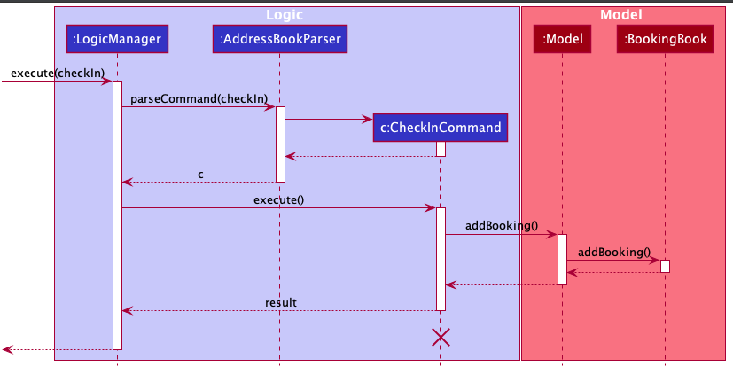
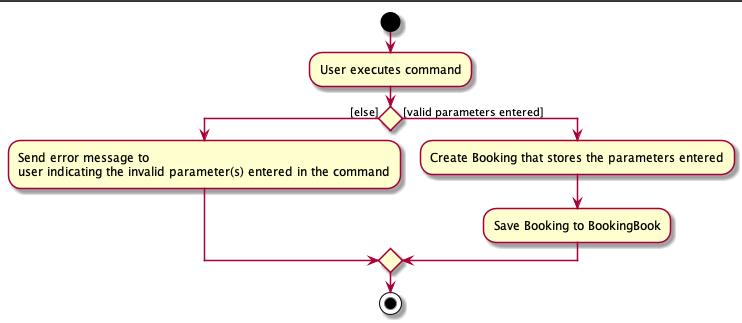

* Table of Contents
{:toc}

--------------------------------------------------------------------------------------------------------------------

## **Setting up, getting started**

Refer to the guide [_Setting up and getting started_](SettingUp.md).

--------------------------------------------------------------------------------------------------------------------

## **Design**

### Architecture

The ***Architecture Diagram*** given above explains the high-level design of the App. Given below is a quick overview of each component.

:bulb: **Tip:** The `.puml` files used to create diagrams in this document can be found in the [diagrams](https://github.com/se-edu/addressbook-level3/tree/master/docs/diagrams/) folder. Refer to the [_PlantUML Tutorial_ at se-edu/guides](https://se-education.org/guides/tutorials/plantUml.html) to learn how to create and edit diagrams.

**`Main`** has two classes called [`Main`](https://github.com/se-edu/addressbook-level3/tree/master/src/main/java/seedu/address/Main.java) and [`MainApp`](https://github.com/se-edu/addressbook-level3/tree/master/src/main/java/seedu/address/MainApp.java). It is responsible for,
* At app launch: Initializes the components in the correct sequence, and connects them up with each other.
* At shut down: Shuts down the components and invokes cleanup methods where necessary.

[**`Commons`**](#common-classes) represents a collection of classes used by multiple other components.

The rest of the App consists of four components.

* [**`UI`**](#ui-component): The UI of the App.
* [**`Logic`**](#logic-component): The command executor.
* [**`Model`**](#model-component): Holds the data of the App in memory.
* [**`Storage`**](#storage-component): Reads data from, and writes data to, the hard disk.

Each of the four components,

* defines its *API* in an `interface` with the same name as the Component.
* exposes its functionality using a concrete `{Component Name}Manager` class (which implements the corresponding API `interface` mentioned in the previous point.

For example, the `Logic` component (see the class diagram given below) defines its API in the `Logic.java` interface and exposes its functionality using the `LogicManager.java` class which implements the `Logic` interface.

**How the architecture components interact with each other**

The *Sequence Diagram* below shows how the components interact with each other for the scenario where the user issues the command `delete 1`.

The sections below give more details of each component.

### UI component

**API** :
[`Ui.java`](https://github.com/se-edu/addressbook-level3/tree/master/src/main/java/seedu/address/ui/Ui.java)

The UI consists of a `MainWindow` that is made up of parts e.g.`CommandBox`, `ResultDisplay`, `PersonListPanel`, `StatusBarFooter` etc. All these, including the `MainWindow`, inherit from the abstract `UiPart` class.

The `UI` component uses JavaFx UI framework. The layout of these UI parts are defined in matching `.fxml` files that are in the `src/main/resources/view` folder. For example, the layout of the [`MainWindow`](https://github.com/se-edu/addressbook-level3/tree/master/src/main/java/seedu/address/ui/MainWindow.java) is specified in [`MainWindow.fxml`](https://github.com/se-edu/addressbook-level3/tree/master/src/main/resources/view/MainWindow.fxml)

The `UI` component,

* Executes user commands using the `Logic` component.
* Listens for changes to `Model` data so that the UI can be updated with the modified data.

### Logic component

**API** :
[`Logic.java`](https://github.com/se-edu/addressbook-level3/tree/master/src/main/java/seedu/address/logic/Logic.java)

1. `Logic` uses the `AddressBookParser` class to parse the user command.
1. This results in a `Command` object which is executed by the `LogicManager`.
1. The command execution can affect the `Model` (e.g. adding a person).
1. The result of the command execution is encapsulated as a `CommandResult` object which is passed back to the `Ui`.
1. In addition, the `CommandResult` object can also instruct the `Ui` to perform certain actions, such as displaying help to the user.

Given below is the Sequence Diagram for interactions within the `Logic` component for the `execute("delete 1")` API call.

:information_source: **Note:** The lifeline for `DeleteCommandParser` should end at the destroy marker (X) but due to a limitation of PlantUML, the lifeline reaches the end of diagram.

### Model component

**API** : [`Model.java`](https://github.com/se-edu/addressbook-level3/tree/master/src/main/java/seedu/address/model/Model.java)

The `Model`,

* stores a `UserPref` object that represents the user’s preferences.
* stores the address book data.
* exposes an unmodifiable `ObservableList<Person>` that can be 'observed' e.g. the UI can be bound to this list so that the UI automatically updates when the data in the list change.
* does not depend on any of the other three components.

:information_source: **Note:** An alternative (arguably, a more OOP) model is given below. It has a `Tag` list in the `AddressBook`, which `Person` references. This allows `AddressBook` to only require one `Tag` object per unique `Tag`, instead of each `Person` needing their own `Tag` object. 

### Storage component

**API** : [`Storage.java`](https://github.com/se-edu/addressbook-level3/tree/master/src/main/java/seedu/address/storage/Storage.java)

The `Storage` component,
* can save `UserPref` objects in json format and read it back.
* can save the address book data in json format and read it back.

### Common classes

Classes used by multiple components are in the `seedu.addressbook.commons` package.

--------------------------------------------------------------------------------------------------------------------

## **Implementation**

This section describes some noteworthy details on how certain features are implemented.

<!-- Create Booking Class -->
#### Booking Class
A `Booking` class is created as an association class of the Person and Room class. Accordingly, `BookingBook` and a 
series of other commands associated with Booking are also created. A `Booking` object is created using the `checjIn`
feature; it can be modified using editBooking and can be deleted from the database using `deleteBooking`.

<!-- Create Booking Class -->

<!-- Find Booking feature -->
#### Find Booking feature  
1.1 Find Booking: finds booking(s) with the following parameters:
`findBooking`
FindBooking features will be used in different senarios: 

1. When the user wish to know the detailed information about a booking. For example, a customer wish to know which room
is he/she checked into. The user can find the room besed on the customer Id, the start date and the end date of the
 booking
                                                            
2. When the user wish to delete/edit a Booking, the user will find the Booking with the relevant parameter first. For 
example, if a customer wish to cancel his booking, the customer Id, the start date and the end date of the booking will
be provided. The user then can use the above information to find out about the booking id which is needed by
other features.

Given below is the example usage scenario:
Step 1: As the user launch the App, the Booking book will load the data from memory, the filteredBookings includes all
the bookings in the bookingList.

Step 2: The user will execute `findBooking pid/3 sd/2020-09-12 ed/2020-09-12`, trying to find the Booking 
associated with person id 1 which starts on 2020-09-12 and end on 2020-09-12. If such booking exist, the Command will 
update the filteredList in the model so UI will update to only show the relevant bookings. 
The user then can view the complete information about the booking(s), 
including the booking id, the room id, the person id, the start and end date, and the isActive state.

Step 3: If the user input is invalid, an error message will be displayed regarding the wrong fields. If no booking
which meet the parameters can be found, the filteredList will be empty hence no
booking will be displayed in UI.

The following sequence diagram shows how the findBooking operation works:

#### Design consideration:
Aspect: which parameters should be allowed to use in find Booking?
- Alternative 1 (current choice): roomId, personId, startDate, endDate, and isActive state
    - Pros: Easy to implement.
    - Cons: Not as convenient as the user would have to search up for the personId first
- Alternative 2: person's name or phone number
    - Pros: More user-friendly as the user only need to key in information once
    - Cons: There are more complexity involved for one feature. When a booking cannot be found, it could be due to
    there is no person information matches up with the given details (the person is not present in the database), or 
    due to a field provided by the customer is incorrect so there is no matching.
<!-- Find Booking feature -->

<!-- Check In feature -->

#### CheckIn feature  
1.1 Check In: checks in a person into a particular room for a specified range of dates - `checkIn`

The check in feature is facilitated by:
1. `Booking` class. `Booking` objects represent the booking made by the person when checked in.
2. `BookingBook`. BookingBook tracks all the bookings created. It implements the following
operation that support the check in feature:
    `BookingBook#addBooking()` - adds a new booking.
    
This operation is exposed in the `Model` interface as `Model#addBooking()`.

Given below is the example usage scenario:

Step 1. The user launches the ConciergeBook application. Data will be loaded from the storage to the application 
memory. The `BookingBook` will be populated with `bookings` and the `AddressBook` will be populated with `persons`.

Step 2. The user executes `checkIn pid/3641 rid/2105 sd/2020-12-25 ed/2020-12-28` command to check in the person, whose
person ID is 3641, into the room that has a room ID of 2105. The person will be checked in to the room from the start
date of 25th December 2020 to the end date of 28th December 2020. 

Step 3. If the parameters entered by the user is valid, the application will create a new `booking` with its own unique booking ID that is stored in the `Model`. 
This `booking` stores the information entered by the user. Else, ConciergeBook will give a display error message
indicating which of the parameter(s) are invalid.

The following sequence diagram shows how the check in operation works:

:information_source: **Note:** If the personal ID or room ID 
that the user keys into the system does not exist, or the start date and end dates are not in the correct format,
a CommandException will be thrown and the error will be displayed to the user. Also, if the start date is
before today's date, or the start date is after the end date, an error message will be similarly shown as well.
Furthermore, if the user tries to check in a person into a room which is already been booked for that specified period,
then an error message will be shown to the user as well.

The following activity diagram summarises what happens when a user executes a `checkIn` command:

#### Design consideration:

##### Aspect: Whether to store the Person in the Room class or create a separate Booking class

* **Alternative 1 (current choice):** Create a Booking class.
  * Pros: No coupling between Person and Room. We can implement feature without modifying Room at all.
  * Cons: More work to create model, storage classes for Booking.

* **Alternative 2:** Stores Person directly in Room class.
  * Pros: More convenient.
  * Cons: Strong coupling between Person and Room. If we modify our Person object, we will have to modify Room.

<!-- Check In feature -->

<!-- Room service feature -->
### Order Room Service feature 

The order room service feature is facilitated by:
1. `RoomService` class. `RoomService` objects represent the room service that a person has ordered. It is tied to a
booking through the bookingId field.
2. `RoomServiceBook`. RoomServiceBook tracks all the RoomService that has been ordered. It implements the following
operations that support the order room service feature:
    1. `RoomServiceBook#addRoomService()` - adds a new room service.
    2. `RoomServiceBook#getRoomServicesForBooking()` - returns the room services ordered for a particular booking.
    This gives user access to room services that has been ordered for a particular booking.
    
These operations are exposed in the `Model` interface as `Model#addRoomService()`, and
`Model#getRoomServicesForBooking()` respectively.

Given below is an example usage scenario:

Step 1. The user launches the application for the first time. The empty `RoomServiceBook`
will be instantiated.

Step 2. The user checks in a guest into a room. A new Booking object will be created with a bookingId.

Step 3. The user receives a request from that guest to order room service.

Step 4. The user keys in the `orderRoomService` command, with parameters `bid/BOOKING_ID`, `rst/ROOM_SERVICE_TYPE`,
where BOOKING_ID is the id of the booking for that guest, and ROOM_SERVICE_TYPE is the type of room service
to be ordered. 

Step 5. The room service will be added and tracked in the RoomServiceBook. When the user checks out, the bill for
the room services ordered will be reflected as well.

Given below is the sequence diagram that shows how the orderRoomService operation works (in step 5).

:information_source: **Note:** If the booking id that the user keys
into the system does not exist, a CommandException will be thrown and the error will be displayed to the user.
Also, if the booking id that the user keys in is for a booking that has already been checked out, an error
will be similarly shown as well. 

#### Design consideration:

##### Aspect: Whether to have a RoomService class

* **Alternative 1 (current choice):** Create a RoomService class.
  * Pros: Decoupling between RoomService and Booking. We can implement feature without modifying Booking at all.
  * Cons: More work to create model, storage classes for RoomService.

* **Alternative 2:** Stores room services ordered directly in Booking class.
  * Pros: More convenient.
  * Cons: Strong coupling between Booking and feature. Will have to modify Booking if we want to modify our feature.
  
##### Aspect: Whether to use subclass or enum to represent different types of RoomService

* **Alternative 1 (current choice):** Use RoomServiceType enum.
  * Pros: Allow us to easily add new types without creating new classes. Easy storage also (as String).
  * Cons: Can have limited difference between different types of RoomService.

* **Alternative 2:** Use subclasses extending from RoomService.
  * Pros: Can have added functionality for different types of RoomService.
  * Cons: A lot of inconvenience to add new types, and to store and retrieve from disk.
 

<!-- Room service feature -->

<!-- Filter Room feature --> 
### Filter Room feature 
#### Description
ConciergeBook allows our user to run the `CheckIn` Command with a Room ID that is not being occupied 
between the indicated start and end date. 

Our user can find out which rooms of certain types are available within a stated start and end dates using the 
`FilterRoom` Command. This room ID can subsequently be used for checking in a guest. 

#### Implementation 
The Filter Room feature is facilitated by the `FilterRoomCommand`. It has the following fields: 
* `sd`: The start date
* `ed`: The end date
* `typ`: The type of room that the user is filtering. The possible types are `SINGLE` (indicated by `1`), `DOUBLE` 
(indicated by `2`) and `SUITE` (indicated by `3`). 
The start date and end date are compulsory fields, while the room type is optional. Omission of the room type will 
result in displaying rooms of all types. 

Given are several examples of usage scenarios when the user prompts to Filter Rooms: 

**Scenario 1**. When the user provides a command with incomplete compulsory fields (e.g. end date), the 
`FilterRoomCommandParser` will throw a `ParseException`, informing that the command is invalid and will return a 
message indicating the correct usage for the `FilterRoomCommand`. 

A similar flow will occur if the user provides an end date that is earlier that is earlier than the inputted start date. 
The `FilterRoomCommandParser` will throw a `ParseException(“Start Date must be before End Date!”)`. The same will occur
if the `typ` parameter is invalid (e.g. not 1, 2, or 3). It will throw a 
`ParseException(“Invalid Room Type. Only 1, 2, 3 allowed.”)`

**Scenario 2 (Ideal Scenario)**. Here is the Sequence Diagram for the `FilterRoomCommand` for an ideal case 
(minor method calls are omitted). 

#### Getting the availableRooms from Model 
Obtaining the list of rooms of the indicated room type which are available between the start and end date is done 
in a 3-step process: 
1. Retrieve the unavailable rooms from the `BookingBook` using the `getUnavailableRooms` method. 
2. Retrieve a list of available rooms by passing the list of unavailable rooms into the `RoomBook` using the 
`getAvailableRooms` method. 
3. The list of available rooms is then filtered by room type, as indicated by the user. 

The following activity diagram summarises what happens when a user executes a `filterRoom` command:

#### Design consideration:
##### Aspect: Retrieving available rooms
**Alternative 1 (current choice)**: Retrieve unavailable rooms from BookingBook first, then retrieve the 
desired list from RoomBook. 
* Pros: Ensures that less dependency on the RoomBook. 
* Cons: Have a slightly lower execution time. 

**Alternative 2**: Rooms should have a field to indicate when they are occupied. 
* Pros: Reduces a 2-step process into a 1-step process. 
* Cons: Strong coupling between Room and Booking. 
Increases the complexity of other commands, such as editBooking and CheckOut due to the increased dependency. 

<!-- Filter Room feature --> 

<!-- Edit booking feature -->
### Edit Booking feature 

The edit booking feature is facilitated by:
1. `Booking` class. `Booking` objects represent the target booking to be replaced and edited booking.
2. `BookingBook`. BookingBook tracks all the bookings created. It implements the following
operation that support the edit booking feature:
    `BookingBook#setBooking()` - set the target booking to the edited booking    
    
These operation is exposed in the `Model` interface as `Model#setBooking()`.

Given below is an example usage scenario:

Step 1. The user launches the ConciergeBook application. Data will be loaded from the storage to the application 
memory. The `BookingBook` will be populated with `bookings` and the `AddressBook` will be populated with `persons`.

Step 2. (Optional) The user executes `listBooking` command to list out all the bookings and find out the booking ID of
the booking to edit.

Step 3. The user executes `editBooking bid/2 rid/2103 sd/2020-12-30 ed/2020-12-31` command to edit booking with booking
ID 2. The room ID will be overwritten by 2103, start date by 30 December 2020, end date by 31 December 2020. Person ID
and booking ID cannot be modified. 

Step 4. If the booking ID exists and there is at least one other parameters to edit, the application will create a new
`booking` to replace the old booking with the booking ID and store it in `Model`. Else, ConciergeBook will display
error message to show sample usage.

Given below is the sequence diagram that shows how the edit booking operation works (in step 5).

:information_source: **Note:** If the booking id that the user keys
into the system does not exist, a CommandException will be thrown and the error will be displayed to the user.
Also, if the only booking ID is specified, an error message will be shown to ask user to provide at least one field.
If the edited booking duplicates or conflicts with existing booking, an error message will be shown as well. 

The following activity diagram summarises what happens when a user executes a `editBooking` command:

<!-- Edit booking feature -->

### \[Proposed\] Undo/redo feature

#### Proposed Implementation

The proposed undo/redo mechanism is facilitated by `VersionedAddressBook`. It extends `AddressBook` with an undo/redo history, stored internally as an `addressBookStateList` and `currentStatePointer`. Additionally, it implements the following operations:

* `VersionedAddressBook#commit()` — Saves the current address book state in its history.
* `VersionedAddressBook#undo()` — Restores the previous address book state from its history.
* `VersionedAddressBook#redo()` — Restores a previously undone address book state from its history.

These operations are exposed in the `Model` interface as `Model#commitAddressBook()`, `Model#undoAddressBook()` and `Model#redoAddressBook()` respectively.

Given below is an example usage scenario and how the undo/redo mechanism behaves at each step.

Step 1. The user launches the application for the first time. The `VersionedAddressBook` will be initialized with the initial address book state, and the `currentStatePointer` pointing to that single address book state.

Step 2. The user executes `delete 5` command to delete the 5th person in the address book. The `delete` command calls `Model#commitAddressBook()`, causing the modified state of the address book after the `delete 5` command executes to be saved in the `addressBookStateList`, and the `currentStatePointer` is shifted to the newly inserted address book state.

Step 3. The user executes `add n/David …​` to add a new person. The `add` command also calls `Model#commitAddressBook()`, causing another modified address book state to be saved into the `addressBookStateList`.

:information_source: **Note:** If a command fails its execution, it will not call `Model#commitAddressBook()`, so the address book state will not be saved into the `addressBookStateList`.

Step 4. The user now decides that adding the person was a mistake, and decides to undo that action by executing the `undo` command. The `undo` command will call `Model#undoAddressBook()`, which will shift the `currentStatePointer` once to the left, pointing it to the previous address book state, and restores the address book to that state.

:information_source: **Note:** If the `currentStatePointer` is at index 0, pointing to the initial AddressBook state, then there are no previous AddressBook states to restore. The `undo` command uses `Model#canUndoAddressBook()` to check if this is the case. If so, it will return an error to the user rather
than attempting to perform the undo.

The following sequence diagram shows how the undo operation works:

:information_source: **Note:** The lifeline for `UndoCommand` should end at the destroy marker (X) but due to a limitation of PlantUML, the lifeline reaches the end of diagram.

The `redo` command does the opposite — it calls `Model#redoAddressBook()`, which shifts the `currentStatePointer` once to the right, pointing to the previously undone state, and restores the address book to that state.

:information_source: **Note:** If the `currentStatePointer` is at index `addressBookStateList.size() - 1`, pointing to the latest address book state, then there are no undone AddressBook states to restore. The `redo` command uses `Model#canRedoAddressBook()` to check if this is the case. If so, it will return an error to the user rather than attempting to perform the redo.

Step 5. The user then decides to execute the command `list`. Commands that do not modify the address book, such as `list`, will usually not call `Model#commitAddressBook()`, `Model#undoAddressBook()` or `Model#redoAddressBook()`. Thus, the `addressBookStateList` remains unchanged.

Step 6. The user executes `clear`, which calls `Model#commitAddressBook()`. Since the `currentStatePointer` is not pointing at the end of the `addressBookStateList`, all address book states after the `currentStatePointer` will be purged. Reason: It no longer makes sense to redo the `add n/David …​` command. This is the behavior that most modern desktop applications follow.

The following activity diagram summarizes what happens when a user executes a new command:

#### Design consideration:

##### Aspect: How undo & redo executes

* **Alternative 1 (current choice):** Saves the entire address book.
  * Pros: Easy to implement.
  * Cons: May have performance issues in terms of memory usage.

* **Alternative 2:** Individual command knows how to undo/redo by
  itself.
  * Pros: Will use less memory (e.g. for `delete`, just save the person being deleted).
  * Cons: We must ensure that the implementation of each individual command are correct.

_{more aspects and alternatives to be added}_

### \[Proposed\] Data archiving

_{Explain here how the data archiving feature will be implemented}_

--------------------------------------------------------------------------------------------------------------------

## **Documentation, logging, testing, configuration, dev-ops**

* [Documentation guide](Documentation.md)
* [Testing guide](Testing.md)
* [Logging guide](Logging.md)
* [Configuration guide](Configuration.md)
* [DevOps guide](DevOps.md)

--------------------------------------------------------------------------------------------------------------------

## **Appendix: Requirements**

### Product scope

**Target user profile**:

* receptionist at a small hotel
* has to handle the checking in and checking out of hotel guests
* has to manage other details of hotel stay (e.g. guest information, bill)
* prefer desktop apps over other types
* can type reasonably fast
* is reasonably comfortable using CLI apps

**Value proposition**: allows receptionist to handle the checking in and out of hotel guests 
faster than a typical mouse/GUI driven app and gives both the receptionist and guests a pleasant experience.

### User stories

Priorities: High (must have) - `* * *`, Medium (nice to have) - `* *`, Low (unlikely to have) - `*`

| Priority | As a …​                                     | I want to …​                                                                                         | So that I …​                                                            |
| -------- | ------------------------------------------ | ----------------------------------------------------------------------------------------------------| ---------------------------------------------------------------------- |
| `* * *`  | hotel receptionist                         | [EPIC] can check-in and check-out both walk-in guests and reservations.                             |                                                                        |
| `* * *`  | hotel receptionist                         | answer walk-in guests’ queries about which rooms are available for a block of dates                 | know which rooms I can check them in                                   |
| `* * *`  | hotel receptionist                         | register guests with a particular room in our system                                                | can keep track of the rooms occupied.                                  |
| `* * *`  | hotel receptionist                         | check out guests from a particular room in our system and make the room available again             | other guests can check in                                              |
| `*`      | hotel receptionist                         | [EPIC] manage the rooms we have available in our system .                                           |                                                                        |
| `*`      | hotel receptionist                         | edit the rooms’ type and price                                                                      | upgrade/downgrade a room                                               |
| `* * *`  | hotel receptionist                         | [EPIC] keep track of the hotel’s customer profiles                                                  |                                                                        |
| `* * *`  | hotel receptionist                         | create new customer profiles as they book rooms                                                     | keep track of their past bookings                                      |
| `* *`    | hotel receptionist                         | search the room he/she has booked with the name/phone number/passport no                            | locate details of persons without having to go through the entire list |
| `* * *`  | hotel receptionist                         | [EPIC] keep track of guests’ billings                                                               |                                                                        |
| `* * *`  | hotel receptionist                         | bill them by the number of nights they stay in a particular room                                    | I can bill them when they check out                                    |

*{More to be added}*

### Use cases

(For all use cases below, the **System** is the `ConciergeBook` and the **Actor** is the `user`, unless specified otherwise)

**Use case `UC01`: Add a person profile**  

**MSS**

1.  User inputs the person's information
2.  ConciergeBook creates the person's profile

    Use case ends.

**Extensions**

1a. Person's information is invalid  
    1a1. ConciergeBook requests for the correct data.  
    1a2. User enters new data.
    Steps 1a1-1a2 are repeated until the data entered are correct.
    Use case resumes from step 2.

  Use case ends.
  
**Use case `UC02`: Delete a person profile**

**MSS**

1.  User finds the person to delete.
2.  User inputs the person's information to delete him/her.
3.  ConciergeBook deletes the person's profile

    Use case ends.

**Extensions**

2a. Person's information cannot be found.  
  2a1. ConciergeBook alerts user that person's information cannot be found.  
  
Use case ends.

**Use case `UC03`: Edit a person profile**

**MSS**

1.  User finds the person to edit.
2.  User inputs the person's updated information to edit his/her profile.
3.  ConciergeBook updates the person's profile

    Use case ends.

**Extensions**

1a. Person's information cannot be found.  
  1a1. ConciergeBook alerts user that person's information cannot be found.  

2a.  Updated information is invalid.  
  2a1.  ConciergeBook requests for correct data.  
  2a2.  User enters new data.
  Steps 2a1-2a2 are repeated until the data entered are correct.
  Use case resumes from step 3.

Use case ends.

**Use case `UC04`: List room**  

**MSS**  

1. User inputs the start date and end date and optionally room type.  
2. ConciergeBook lists out all the available rooms.  

Use case ends.

**Extension**
1a. Start date and/or end date is in invalid format.  
	1a1: ConciergeBook throws error message.   
	Use case resumes at step 1.  

1b.  End date is earlier than start date.  
	1b1: ConciergeBook throws error message.   
	Use case resumes at step 1.  
	
1c. Room type is in invalid.  
	1c1: ConciergeBook throws error message.   
	Use case resumes at step 1.  

**Use case `UC05`: Check in a person**  

**MSS**

1. User finds person.  
2. User inputs the person’s name, phone number, room Id, start date and end date.  
3. ConciergeBook searches the person in the database.  
4. ConciergeBook creates a booking for the person and the room and saves it.  

Use case ends.  

**Extension**  

1a. Person cannot be found.  
    1a1: User <ins>creates a profile for the person (UC01)</ins>.  

2a. User inputs invalid phone number.  
    2a1: ConciergeBook throws error message.  
	Use case resumes at step 1.  

2b. User inputs name and phone number that do not exist in the database.  
	2b1: ConciergeBook throws error message.  
	Use case resumes at step 1.  

2c. User inputs invalid roomId.  
	2c1: ConciergeBook throws error message.   
	Use case resumes at step 1.  

2d. User inputs invalid start date and/or end date.  
	2d1: ConciergeBook throws error message. 
	Use case resumes at step 1.  

2e.  End date is earlier than start date.  
	2e1: ConciergeBook throws error message. 
	Use case resumes at step 1.  

**Use case: `UC06` - List bookings**

**MSS**

1. User inputs optional date, optional name, optional room.  
2.  ConciergeBook lists all the booking on that date.

Use case ends.

**Extension**  
1a. User inputs invalid date, name, room.  
    1a1: ConciergeBook throws an error message.  
    Use case resumes at step 1.  

### Non-Functional Requirements

1.  Should work on any _mainstream OS_ as long as it has Java `11` or above installed.
2.  Should be able to hold up to 1000 records of bookings without a noticeable sluggishness in performance for typical usage.
3.  A user with above average typing speed for regular English text (i.e. not code, not system admin commands)
    should be able to accomplish most of the tasks faster using commands than using the mouse.
4.  Should have a UI that looks like a modern desktop app.
5.  A receptionist new to the app should be able to pick it up quickly.
6.  Should provide helpful prompts and guides receptionist to accomplish tasks. 

*{More to be added}*

### Glossary

* **Mainstream OS**: Windows, Linux, Unix, OS-X
* **Receptionist**: User of the application as defined in the target user profile.
* **Hotel Guest**: The customer of the hotel who will be checking in and out of the hotel.
* **Booking**: Records that track the information of a Hotel Guest's stay with the hotel.
* **Room**: The hotel room that the Hotel Guest is staying in.

--------------------------------------------------------------------------------------------------------------------

## **Appendix: Instructions for manual testing**

Given below are instructions to test the app manually.

:information_source: **Note:** These instructions only provide a starting point for testers to work on;
testers are expected to do more *exploratory* testing.

### Launch and shutdown

1. Initial launch

   1. Download the jar file and copy into an empty folder

   1. Double-click the jar file Expected: Shows the GUI with a set of sample contacts. The window size may not be optimum.

1. Saving window preferences

   1. Resize the window to an optimum size. Move the window to a different location. Close the window.

   1. Re-launch the app by double-clicking the jar file. 
       Expected: The most recent window size and location is retained.

1. _{ more test cases …​ }_

### Deleting a person

1. Deleting a person while all persons are being shown

   1. Prerequisites: List all persons using the `list` command. Multiple persons in the list.

   1. Test case: `delete 1` 
      Expected: First contact is deleted from the list. Details of the deleted contact shown in the status message. Timestamp in the status bar is updated.

   1. Test case: `delete 0` 
      Expected: No person is deleted. Error details shown in the status message. Status bar remains the same.

   1. Other incorrect delete commands to try: `delete`, `delete x`, `...` (where x is larger than the list size) 
      Expected: Similar to previous.

1. _{ more test cases …​ }_

### Saving data

1. Dealing with missing/corrupted data files

   1. _{explain how to simulate a missing/corrupted file, and the expected behavior}_

1. _{ more test cases …​ }_
