* Table of Contents
{:toc}

--------------------------------------------------------------------------------------------------------------------

## **Setting up, getting started**

Refer to the guide [_Setting up and getting started_](SettingUp.md).

--------------------------------------------------------------------------------------------------------------------

## **Design**

### Architecture

The ***Architecture Diagram*** given above explains the high-level design of the App. Given below is a quick overview of each component.

:bulb: **Tip:** The `.puml` files used to create diagrams in this document can be found in the [diagrams](https://github.com/AY2021S1-CS2103-W14-2/tp/tree/master/docs/diagrams) folder. Refer to the [_PlantUML Tutorial_ at se-edu/guides](https://se-education.org/guides/tutorials/plantUml.html) to learn how to create and edit diagrams.

**`Main`** has two classes called [`Main`](https://github.com/AY2021S1-CS2103-W14-2/tp/blob/master/src/main/java/seedu/address/Main.java) and [`MainApp`](https://github.com/AY2021S1-CS2103-W14-2/tp/blob/master/src/main/java/seedu/address/MainApp.java). It is responsible for,
* At app launch: Initializes the components in the correct sequence, and connects them up with each other.
* At shut down: Shuts down the components and invokes cleanup methods where necessary.

[**`Commons`**](#common-classes) represents a collection of classes used by multiple other components.

The rest of the App consists of four components.

* [**`UI`**](#ui-component): The UI of the App.
* [**`Logic`**](#logic-component): The command executor.
* [**`Model`**](#model-component): Holds the data of the App in memory.
* [**`Storage`**](#storage-component): Reads data from, and writes data to, the hard disk.

Each of the four components,

* defines its *API* in an `interface` with the same name as the Component.
* exposes its functionality using a concrete `{Component Name}Manager` class (which implements the corresponding API `interface` mentioned in the previous point.

For example, the `Logic` component (see the class diagram given below) defines its API in the `Logic.java` interface and exposes its functionality using the `LogicManager.java` class which implements the `Logic` interface.

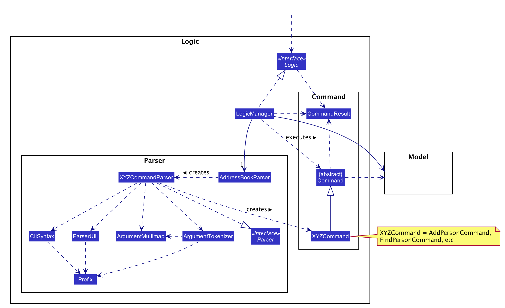

**How the architecture components interact with each other**

The *Sequence Diagram* below shows how the components interact with each other for the scenario where the user issues the command `deletePerson pid/1`.

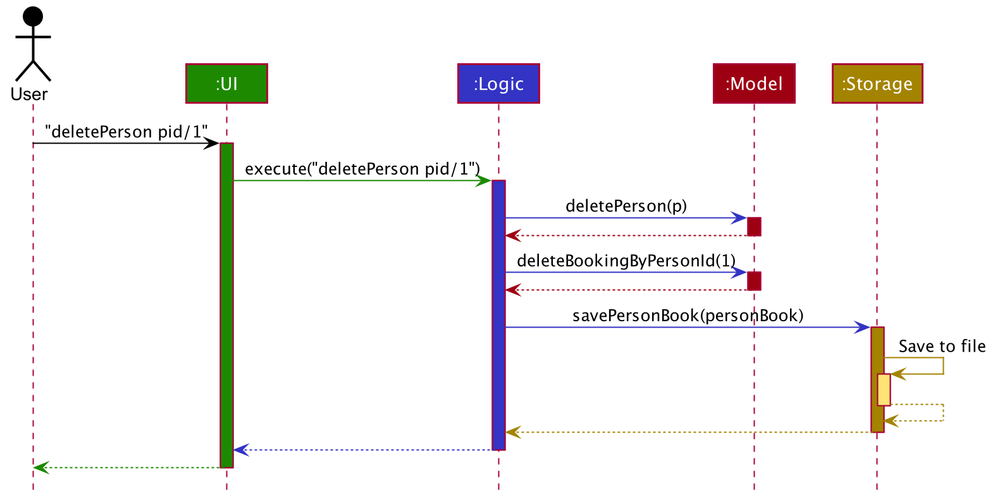

The sections below give more details of each component.

### UI component

**API** :
[`Ui.java`](https://github.com/AY2021S1-CS2103-W14-2/tp/blob/master/src/main/java/seedu/address/ui/Ui.java)

The UI consists of a `MainWindow` that is made up of parts e.g.`CommandBox`, `ResultDisplay`, `PersonListPanel`, `StatusBarFooter`, `BookingListPanel` etc. All these, including the `MainWindow`, inherit from the abstract `UiPart` class.

The `UI` component uses JavaFx UI framework. The layout of these UI parts are defined in matching `.fxml` files that are in the `src/main/resources/view` folder. For example, the layout of the [`MainWindow`](https://github.com/AY2021S1-CS2103-W14-2/tp/blob/master/src/main/java/seedu/address/ui/MainWindow.java) 
is specified in [`MainWindow.fxml`](https://github.com/AY2021S1-CS2103-W14-2/tp/blob/master/src/main/resources/view/MainWindow.fxml)

The `UI` component,

* Executes user commands using the `Logic` component.
* Listens for changes to `Model` data so that the UI can be updated with the modified data.

### Logic component

**API** :
[`Logic.java`](https://github.com/AY2021S1-CS2103-W14-2/tp/blob/master/src/main/java/seedu/address/logic/Logic.java)

1. `Logic` uses the `AddressBookParser` class to parse the user command.
1. This results in a `Command` object which is executed by the `LogicManager`.
1. The command execution can affect the `Model` (e.g. adding a person).
1. The result of the command execution is encapsulated as a `CommandResult` object which is passed back to the `Ui`.
1. In addition, the `CommandResult` object can also instruct the `Ui` to perform certain actions, such as displaying help to the user.

Given below is the Sequence Diagram for interactions within the `Logic` component for the `execute("deletePerson pid/1")` API call.

:information_source: **Note:** The lifeline for `DeleteCommandParser` 
should end at the destroy marker (X) but due to a limitation of PlantUML, the lifeline reaches the end of diagram.

### Model component

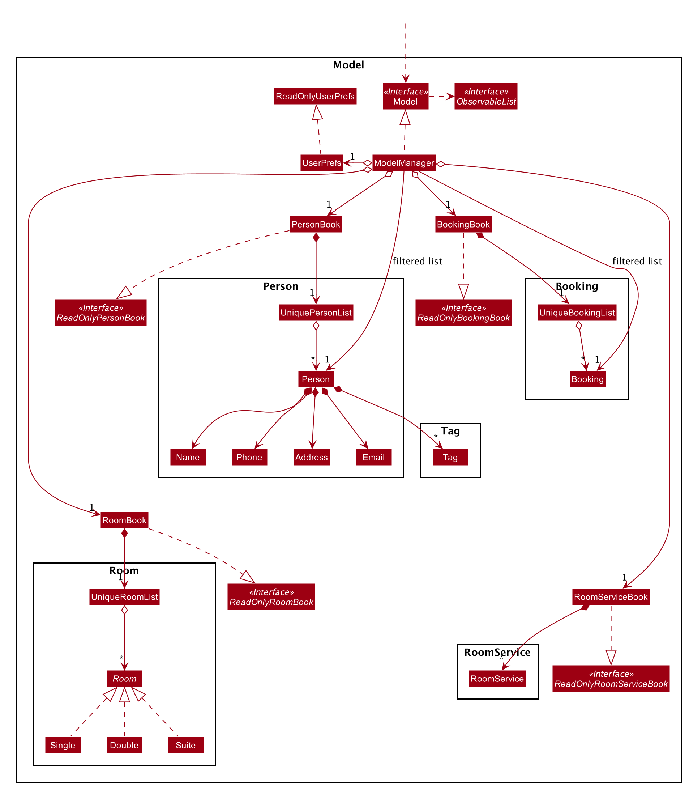

**API** : [`Model.java`](https://github.com/AY2021S1-CS2103-W14-2/tp/blob/master/src/main/java/seedu/address/model/Model.java)

The `Model`,

* stores a `UserPref` object that represents the user’s preferences.
* stores the person book, booking book, room book and room service book data.
* exposes an unmodifiable `ObservableList<Person>` and `ObservableList<Booking>` that can be 'observed' 
e.g. the UI can be bound to this list so that the UI automatically updates when the data in the list change.
* does not depend on any of the other three components.

:information_source: **Note:** An alternative (arguably, a more OOP) model is given below. It has a `Tag` list in the `PersonBook`, which `Person` references. This allows `PersonBook` to only require one `Tag` object per unique `Tag`, instead of each `Person` needing their own `Tag` object. 

### Storage component

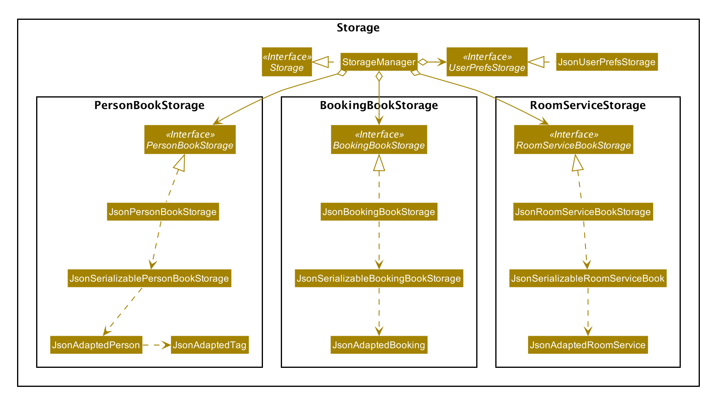

**API** : [`Storage.java`](https://github.com/AY2021S1-CS2103-W14-2/tp/blob/master/src/main/java/seedu/address/storage/Storage.java)

The `Storage` component,
* can save `UserPref` objects in json format and read it back.
* can save the person book, booking book and room service book data in json format and read it back.

### Common classes

Classes used by multiple components are in the `seedu.addressbook.commons` package.

--------------------------------------------------------------------------------------------------------------------

## **Implementation**

This section describes some noteworthy details on how certain features are implemented.

<!-- Create Booking Class -->
### Booking Class
A `Booking` class is created as an association class of the Person and Room class. Accordingly, `BookingBook` and a
series of other commands associated with Booking are also created. A `Booking` object is created using the `addBooking`
feature; it can be modified using `editBooking` and can be deleted from the database using `deleteBooking`.

<!-- Create Booking Class -->

<!-- Add Booking feature -->

### Add Booking feature  
Add Booking: adds a booking. A person, a particular room, and a specified range of dates is tied to that booking - `addBooking`

The add booking feature is facilitated by:
1. `Booking` class. `Booking` objects represent the booking made by the person when booking is added.
2. `BookingBook`. BookingBook tracks all the bookings created. It implements the following
operation that support the add booking feature:
    `BookingBook#addBooking()` - adds a new booking.
    
This operation is exposed in the `Model` interface as `Model#addBooking()`.

Given below is the example usage scenario:

Step 1. The user launches the ConciergeBook application. Data will be loaded from the storage to the application
memory. The `BookingBook` will be populated with `bookings` and the `PersonBook` will be populated with `persons`.

Step 2. The user executes `addBooking pid/3641 rid/2105 sd/2020-12-25 ed/2020-12-28` command to add a booking. The booking
contains several values, a person ID of 3641, a room ID of 2105, and start date and end date of 25th December 2020
and 28th December 2020 respectively. 

Step 3. If the parameters entered by the user is valid, the application will create a new `booking` with its own unique
booking ID that is stored in the `Model`. 
This `booking` stores the information entered by the user. Else, ConciergeBook will display an error message
indicating that the user did not type in the parameters correctly.

The following sequence diagram shows how the add booking operation works:  
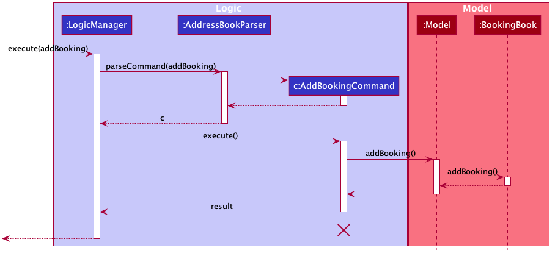

:information_source: **Note:** If the person ID or room ID 
that the user keys into the system does not exist, or the start date and end dates are not in the correct format,
a CommandException will be thrown and the error will be displayed to the user. Also, if the start date is after the 
end date, an error message will be similarly shown as well. Furthermore, if the user tries to add a booking that ties a person
with a room which has already been booked for that specified period, then an error message will be shown to the user as well.

The following activity diagram summarises what happens when a user executes a `addBooking` command:

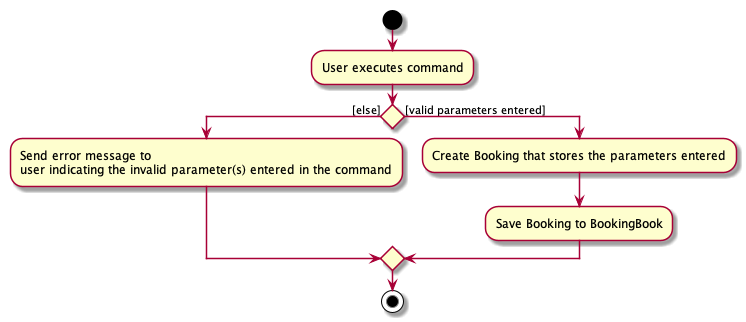

#### Design consideration:

##### Aspect: Whether to store the Person in the Room class or create a separate Booking class

* **Alternative 1 (current choice):** Create a Booking class.
  * Pros: No coupling between Person and Room. We can implement feature without modifying Room at all.
  * Cons: More work to create model, storage classes for Booking.

* **Alternative 2:** Stores Person directly in Room class.
  * Pros: More convenient.
  * Cons: Strong coupling between Person and Room. If we modify our Person object, we will have to modify Room.

<!-- Add Booking feature -->

<!-- Edit booking feature -->
### Edit Booking feature 

The edit booking feature is facilitated by:
1. `Booking` class. `Booking` objects represent the target booking to be replaced and edited booking.
2. `BookingBook`. BookingBook tracks all the bookings created. It implements the following
operation that support the edit booking feature:
    `BookingBook#setBooking()` - set the target booking to the edited booking    
    
These operation is exposed in the `Model` interface as `Model#setBooking()`.

Given below is an example usage scenario:

Step 1. The user launches the ConciergeBook application. Data will be loaded from the storage to the application 
memory. The `BookingBook` will be populated with `bookings` and the `PersonBook` will be populated with `persons`.

Step 2. (Optional) The user executes `listBooking` command to list out all the bookings and find out the booking ID of
the booking to edit.

Step 3. The user executes `editBooking bid/2 rid/2103 sd/2020-12-30 ed/2020-12-31` command to edit booking with booking
ID 2. The room ID will be overwritten by 2103, start date by 30 December 2020, end date by 31 December 2020. Person ID
and booking ID cannot be modified. 

Step 4. If the booking ID exists and there is at least one other parameters to edit, the application will create a new
`booking` to replace the old booking with the booking ID and store it in `Model`. Else, ConciergeBook will display
error message to show sample usage.

Given below is the sequence diagram that shows how the edit booking operation works.

:information_source: **Note:** If the booking ID that the user keys
into the system does not exist, a CommandException will be thrown and the error will be displayed to the user.
Also, if the only booking ID is specified, an error message will be shown to ask user to provide at least one field.
If the edited booking duplicates or conflicts with existing booking, an error message will be shown as well. 

The following activity diagram summarises what happens when a user executes a `editBooking` command:

#### Design consideration:

##### Aspect: Whether to update the existing booking or create new booking with edited fields to replace the existing booking.

* **Alternative 1 (current choice):** Create new booking with edited fields to replace the existing booking.
  * Pros: Making `Booking` an immutable object increases the testability of the code and makes the command less error-prone.
  * Cons: More work to create new booking and replace it in the list of bookings in model.

* **Alternative 2:** Update the existing booking
  * Pros: Easier to implement.
  * Cons: More difficult to test.

<!-- Edit booking feature -->

<!-- Find Booking feature -->
### Find Booking feature
Find Booking: finds booking(s) with the following parameters: person ID, room ID, start date, end date and isArchived state - `findBooking`

The Find Booking feature is facilitated by:
1. `Booking` class. 
2. `BookingBook` class. BookingBook tracks all the bookings created. It implements the following
      operation that supports delete booking feature:
    `updateFilteredBookingList()` - update filteredBookingList with a predicate.

This operation is exposed in the `Model` interface as `Model#updateFilteredBookingList`.

FindBooking features will be used in different scenarios:

1. When the user wishes to know the detailed information about a booking. For example, a customer wishes to know which room
is he/she allocated to. The user can find the room based on the person ID, the start date and the end date of the booking.                                      
2. When the user wish to delete/edit a Booking, the user will find the Booking with the relevant parameter first. For
example, if a customer wish to cancel his booking, the person ID, the start date and the end date of the booking will
be provided. The user then can use the above information to find out about the booking ID which is needed by
other features.

Given below is the example usage scenario:

Step 1: As the user launch the App, the Booking book will load the data from memory, the filteredBookings includes all
the bookings in the bookingList.

Step 2: The user will execute `findBooking pid/3 sd/2020-09-12 ed/2020-09-13`, trying to find the Booking 
associated with person ID 3 which starts on 2020-09-12 and end on 2020-09-13. If such booking exist, the Command will 
update the filteredList in the model so UI will update to only show the relevant bookings. 
The user then can view the complete information about the booking(s), 
including the booking ID, the room ID, the person ID, the start and end date, and the isArchived state.

Step 3: If the user input is invalid, an error message will be displayed regarding the wrong fields. If no booking
which meet the parameters can be found, the filteredList will be empty hence no booking will be displayed in UI.

The following sequence diagram shows how the findBooking operation works:
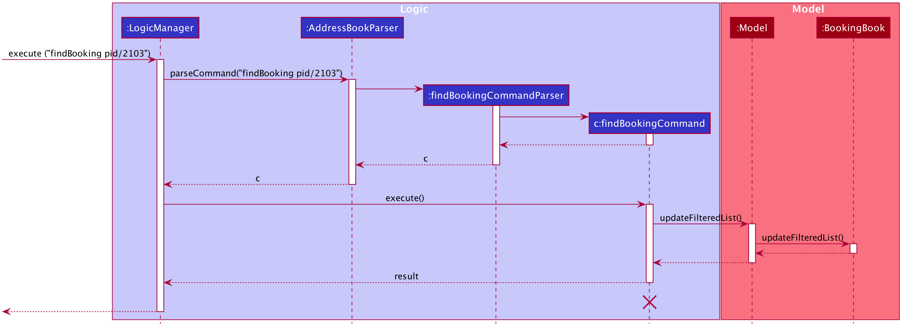

#### Design consideration:
##### Aspect: which parameters should be allowed to use in find Booking?
* **Alternative 1 (current choice)**: room ID, person ID, startDate, endDate, and isArchived state
    - Pros: Easy to implement.
    - Cons: Not as convenient as the user would have to search up for the person ID first.
* **Alternative 2**: person's name or phone number
    - Pros: More user-friendly as the user only need to use one command.
    - Cons: There are more complexity involved for one feature. When a booking cannot be found, it could be due to
    there is no person information matches up with the given details (the person is not present in the database), or 
    due to a field provided by the customer is incorrect so there is no matching.
<!-- Find Booking feature -->

<!-- Delete Booking feature -->
### Delete Booking feature
Delete Booking: Delete the booking with the given booking ID `deleteBooking`

The delete booking feature is facilitated by:
1. `Booking` class. 
2. `BookingBook` class. BookingBook tracks all the bookings created. It implements the following
   operation that supports delete booking feature:
    `deleteBooking()` - delete the booking object provided argument.

This operation is exposed in the `Model` interface as `Model#deleteBooking()`.

Given below is an example usage scenario:

Step 1. The user launches the ConciergeBook application. Data will be loaded from the storage to the application 
        memory. The `BookingBook` will be populated with bookings.

Step 2. The user receives a request to cancel a booking, and the user deems that it is unnecessary to leave and data of the cancelled booking in the database.

Step 3. The user keys in the `deleteBooking` command, with parameters `bid/BOOKING_ID` where BOOKING_ID is the id of the booking for that guest.

Step 4. If the parameters entered by the user is valid, the booking will be removed from the booking book. 
        When the input is invalid (e.g. no booking with booking ID can be found), ConciergeBook will display an error message.
        
The following sequence diagram shows how the deleteBooking operation works:
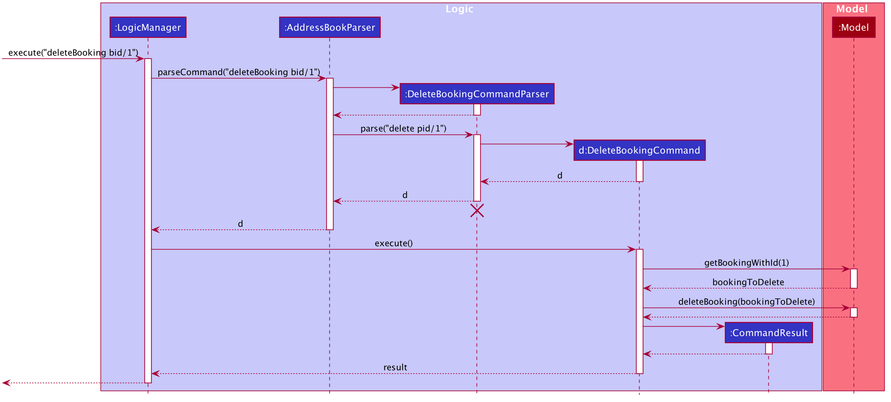

#### Design consideration:
##### Aspect: Should user use display index or booking ID to locate the Booking
* **Alternative 1 (current choice)**: booking ID
    - Pros: Since bid/Booking ID is also used in other command (e.g. addBooking and findBooking), its usage is standardised.  
    - Cons: Not as convenient as the user need to look for the booking ID.
* **Alternative 2**: display index
    - Pros: Easy to implement: can reuse addressBook code
    - Cons: Since we have multiple lists in the app, it is possible that the user will be jumping between different lists. 
    For example, a person might remember there is a booking to be deleted at index 4, but he proceeds to change the `personBook` which results in a change in the bookingBook (eg. deletePerson).
    Generally, referencing using ID is more reliable as ID is fixed and unique.
<!-- Delete Booking feature -->

<!-- Archive and Unarchive Booking feature -->
### Archive and Unarchive Booking feature

The archive and unarchive booking feature is facilitated by:
1. `active` boolean flag in `Booking` class. When `active = false`, a booking is considered "archived".
1. The archive booking feature simply sets this flag in the Booking class to false in order to archive a booking. Similarly, 
the unarchive booking feature would set this flag back to true to unarchive a booking.

This operation is exposed in the `Model` interface as `Model#setBookingInactive()`.

The archive operation is used when a user wants to "delete" a Booking, but still want to retain the Booking in the hard disk. This Booking will be considered "deleted", and another guest will be able to stay in the same room during the same period as this Booking.
In case a booking had been mistakenly archived, or that an archived booking had to be unarchived to meet business requirements, the unarchive operation allows the user to reverse his/her decision and restore the archived booking.

<!-- Archive and Unarchive Booking feature -->

<!-- Room service feature -->
### Order Room Service feature 

The order room service feature is facilitated by:
1. `RoomService` class. `RoomService` objects represent the room service that a person has ordered. It is tied to a
booking through the booking ID field.
2. `RoomServiceBook`. RoomServiceBook tracks all the RoomService that has been ordered. It implements the following
operations that support the order room service feature:
    1. `RoomServiceBook#addRoomService()` - adds a new room service.
    2. `RoomServiceBook#getRoomServicesForBooking()` - returns the room services ordered for a particular booking.
    This gives user access to room services that has been ordered for a particular booking.
    
These operations are exposed in the `Model` interface as `Model#addRoomService()`, and
`Model#getRoomServicesForBooking()` respectively.

Given below is an example usage scenario:

Step 1. The user launches the application for the first time. The empty `RoomServiceBook`
will be instantiated.

Step 2. The user checks in a guest into a room. A new Booking object will be created with a booking ID.

Step 3. The user receives a request from that guest to order room service.

Step 4. The user keys in the `orderRoomService` command, with parameters `bid/BOOKING_ID`, `rst/ROOM_SERVICE_TYPE`,
where BOOKING_ID is the id of the booking for that guest, and ROOM_SERVICE_TYPE is the type of room service
to be ordered. 

Step 5. The room service will be added and tracked in the RoomServiceBook. When the user calls `getBill` , the bill for
the room services ordered will be reflected as well.

Given below is the sequence diagram that shows how the orderRoomService operation works (in step 5).

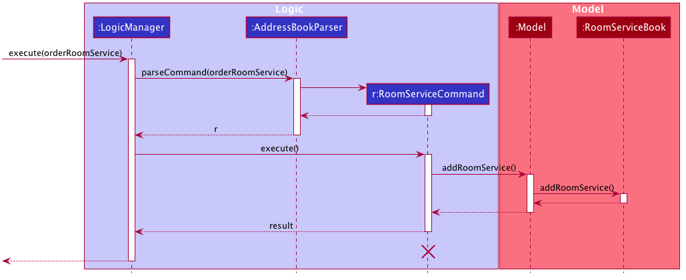

:information_source: **Note:** If the booking ID that the user keys
into the system does not exist, a CommandException will be thrown and the error will be displayed to the user.
Also, if the booking ID that the user keys in is for a booking that has already been archived, an error
will be similarly shown as well. 

#### Design consideration:

##### Aspect: Whether to have a RoomService class

* **Alternative 1 (current choice):** Create a RoomService class.
  * Pros: Decoupling between RoomService and Booking. We can implement feature without modifying Booking at all.
  * Cons: More work to create model, storage classes for RoomService.

* **Alternative 2:** Stores room services ordered directly in Booking class.
  * Pros: More convenient.
  * Cons: Strong coupling between Booking and feature. Will have to modify Booking if we want to modify our feature.
  
##### Aspect: Whether to use subclass or enum to represent different types of RoomService

* **Alternative 1 (current choice):** Use RoomServiceType enum.
  * Pros: Allow us to easily add new types without creating new classes. Easy storage also (as String).
  * Cons: Can have limited difference between different types of RoomService.

* **Alternative 2:** Use subclasses extending from RoomService.
  * Pros: Can have added functionality for different types of RoomService.
  * Cons: A lot of inconvenience to add new types, and to store and retrieve from disk.
 

<!-- Room service feature -->

<!-- Filter Room feature --> 
### Filter Room feature 
ConciergeBook allows our user to run the `addBooking` Command with a Room ID that is not being occupied 
between the indicated start and end date. 

Our user can find out which rooms of certain types are available within a stated start and end dates using the 
`FilterRoom` Command. This room ID can subsequently be used for adding a booking for a guest. 

The Filter Room feature is facilitated by the `FilterRoomCommand`. It has the following fields: 
* `sd`: The start date
* `ed`: The end date
* `typ`: The type of room that the user is filtering. The possible types are `SINGLE` (indicated by `1`), `DOUBLE` 
(indicated by `2`) and `SUITE` (indicated by `3`). 
The start date and end date are compulsory fields, while the room type is optional. Omission of the room type will 
result in displaying rooms of all types. 

Given are several examples of usage scenarios when the user prompts to Filter Rooms: 

**Scenario 1**. When the user provides a command with incomplete compulsory fields (e.g. end date), the 
`FilterRoomCommandParser` will throw a `ParseException`, informing that the command is invalid and will return a 
message indicating the correct usage for the `FilterRoomCommand`. 

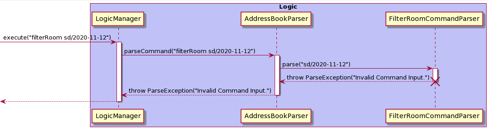

A similar flow will occur if the user provides an end date that is earlier than the inputted start date. 
The `FilterRoomCommandParser` will throw a `ParseException(“Start Date must be before End Date!”)`. The same will occur
if the `typ` parameter is invalid (e.g. not 1, 2, or 3). It will throw a 
`ParseException(“Invalid Room Type. Only 1, 2, 3 allowed.”)`

**Scenario 2 (Ideal Scenario)**. Here is the Sequence Diagram for the `FilterRoomCommand` for an ideal case 
(minor method calls are omitted). 

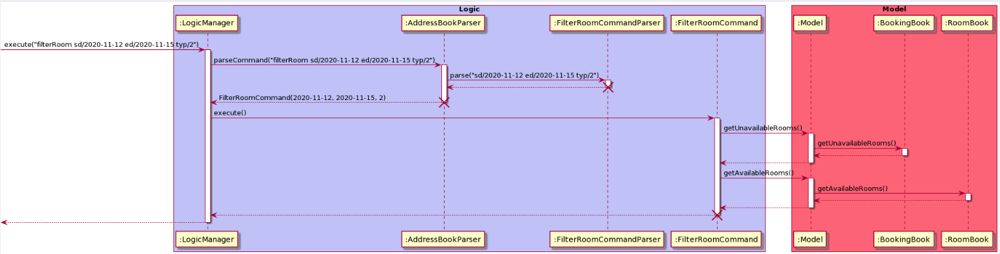

Obtaining the list of rooms of the indicated room type which are available between the start and end date is done 
in a 3-step process: 
1. Retrieve the unavailable rooms from the `BookingBook` using the `getUnavailableRooms` method. 
2. Retrieve a list of available rooms by passing the list of unavailable rooms into the `RoomBook` using the 
`getAvailableRooms` method. 
3. The list of available rooms is then filtered by room type, as indicated by the user. 

The following activity diagram summarises what happens when a user executes a `filterRoom` command:

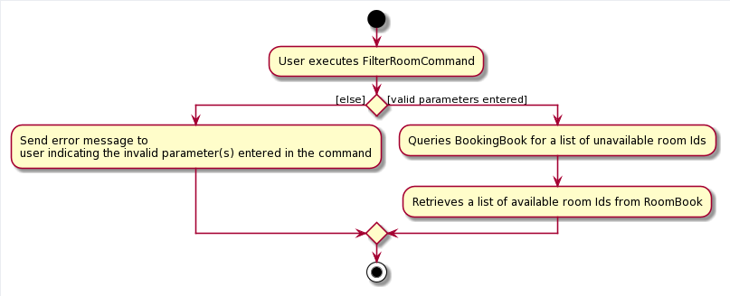

#### Design consideration:
##### Aspect: Retrieving available rooms
**Alternative 1 (current choice)**: Retrieve unavailable rooms from BookingBook first, then retrieve the 
desired list from RoomBook. 
* Pros: Ensures that less dependency on the rooms in RoomBook. 
* Cons: Have a slightly lower execution time. 

**Alternative 2**: Rooms should have a field to indicate when they are occupied. 
* Pros: Reduces a 2-step process into a 1-step process. 
* Cons: Strong coupling between Room and Booking. 
Increases the complexity of other commands, such as editBooking and archive due to the increased dependency. 
We also concluded that there was no need for rooms to know when they are occupied - this should be handled by the Bookings. 

<!-- Filter Room feature --> 

<!-- Get Bill feature --> 
### Get Bill feature 
The get bill feature is facilitated by: 
1. `BookingBook`. The Booking Book keeps track of details of all the Bookings available in the system. 
1. `RoomBook`. The Room Book keeps track of the price and types of all Rooms available in the system. 
1. `RoomServiceBook`. The Room Service Book keeps track of all room services ordered by all rooms. 

Given below is an example usage scenario:  
Step 1. The user adds a booking to the system, which creates a new Booking with a booking ID.  
Step 2. The user requests for several room services for the room using the booking ID.  
Step 3. The user wants to calculate the total bill for the stay, including the room services ordered.  
Step 4. The user keys in `getBill` command, with the `booking ID` as the parameter, where booking ID is the id of the booking for that guest.  
Step 5. A receipt will be generated, informing the user of the total bill and a breakdown of the bill.  

Given below is the sequence diagram that shows how the `getBill` operation works in Step 5. 

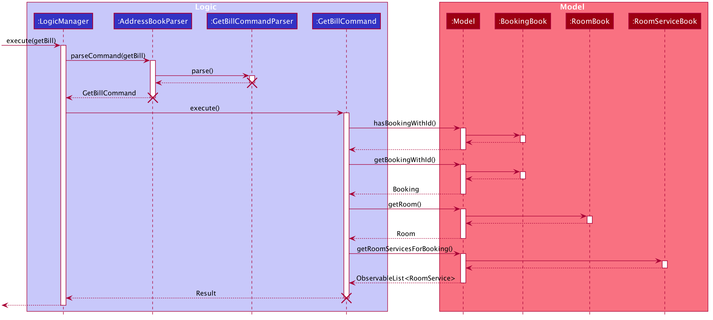

:information_source: **Note:** If the booking ID that the user keys
into the system does not exist, a CommandException will be thrown and the error will be displayed to the user.

Obtaining the total price of the stay is achieved in a 5-step process. 
1. Using the booking ID inputted by the user, the `BookingBook` will be accessed to retrieve the details of the booking.
1. The roomId of the booking will be used to access the `RoomBook`. The room associated with the booking will be retrieved. 
1. The base price of the room is calculated using the price of the room and the number of nights stayed, which is taken from the details of the booking. 
1. The booking ID will also be used to retrieve the list of room services ordered by the guest from the `RoomServiceBook`. 
1. The total bill for the stay is then computed and a receipt is generated. 

The following activity diagram summarises what happens when a user executes a `getBill` command: 
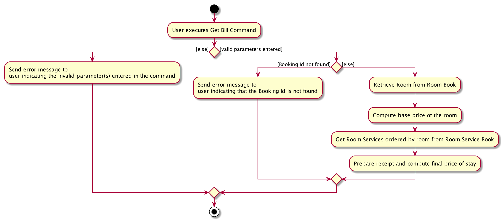

#### Design consideration:
##### Aspect: Calculating the total price
**Alternative 1 (current choice)**: Compute the final bill only when requested.
* Pros: Ensures that there is less dependency on the bookings and allows for modifications to the duration of the stay.  
* Cons: Have a slightly lower execution time. 

**Alternative 2**: Maintain a total bill field in every booking and update the price whenever a change happens (e.g. room service ordered or edit booking duration). 
* Pros: Reduces the steps needed.  
* Cons: Have to ensure price is always maintained correctly when a change happens.
If the application is developed further to accommodate the removal of room services, it would complicate the procedure and make it prone to bugs. 
Bookings can also be edited. Hence, editing the duration of the booking would affect this initially computed price and there is a need to calculate the price again. 
<!-- Get Bill feature --> 

--------------------------------------------------------------------------------------------------------------------

## **Documentation, logging, testing, configuration, dev-ops**

* [Documentation guide](Documentation.md)
* [Testing guide](Testing.md)
* [Logging guide](Logging.md)
* [Configuration guide](Configuration.md)
* [DevOps guide](DevOps.md)

--------------------------------------------------------------------------------------------------------------------

## **Appendix A: Effort**

This section aims to document the effort that our team has put into creating ConciergeBook, which we estimate took
more than the effort it takes to create AB3 due to the various complexities involved.

### Challenges & Effort Required
1. The most crucial challenge for ConciergeBook was the need to create and manage a lot more entities as compared to 
AB3. We had to extend AB3, which only had the `Person` entity, and add other entities needed to be represented in a hotel booking: these includes the `Room` entity and the `Booking` entity itself. We thus required the following effort:
    1. Creating these new entities entail creating the appropriate classes in the `model` package to manage these entities in memory.
    1. We also had to create `storage` classes to save the bookings on the hard disk.
1. To allow our user to manage the hotel bookings, we also have to create new user features which required us to manage complexities involved in dealing with multiple entities. For example,
    1. To allow our user to see which rooms are available for booking, we have to manage both the `Room` and `Booking` entites, in order to find out which rooms are not booked at a particular time period.
    1. Allowing users to manage Booking objects also span multiple entities - as a `Booking` is defined to have a `Room` and a `Person` as well. As such, we have to manage complexities such as checking whether the Person/Room exists before creating the Booking, and also complexities that come with dealing with dates, such as checking whether a booking is in conflict with another booking. i.e. they occupy the same room during the same period.
1. To enhance the user experience, we also added extension functionalities that required significant effort from our end:
    1. Notably, we added another entity `RoomService` (along with `model` and `storage` classes) to allow our user to track the room services ordered by the hotel guests. This entity combined with the `getBill` command allows the user to return the total bill for a booking - including the cost of stay and room services ordered.
1. To support the management of bookings, we extended the AB3's UI to show the list of bookings as well. We also added in a home page to show useful information to the user. These required changes to the UI, and throughout the app as well to allow the `logic` of our app to switch between the different UIs available.

### Achievements
1. Added more than **12,000** lines of code to AB3.
2. Added 3 more entities (`Room`, `Booking`, `RoomService`) on top of AB3's `Person` entity
3. Have a total of 20 user commands (AB3 has 8)
4. Have a total of 496 test cases (compared to the original 200+ in AB3) and increased test coverage to 74% despite adding a lot more code.

--------------------------------------------------------------------------------------------------------------------

## **Appendix B: Product scope**

**Target user profile**:

* receptionist at a small hotel
* has to handle the bookings of guests
* has to manage other details of hotel stay (e.g. guest information, bill)
* prefer desktop apps over other types
* can type reasonably fast
* is reasonably comfortable using CLI apps

**Value proposition**: allows receptionist to handle the bookings of guests 
faster than a typical mouse/GUI driven app and gives both the receptionist and guests a pleasant experience.

## **Appendix C: User stories**

Priorities: High (must have) - `* * *`, Medium (nice to have) - `* *`, Low (unlikely to have) - `*`

| Priority | As a …​              | I want to …​                                                                                         | So that I …​                                                            |
| -------- | --------------------| ----------------------------------------------------------------------------------------------------| ---------------------------------------------------------------------- |
| `* * *`  | hotel receptionist  | [EPIC] can manage the bookings in the hotel.                                                        |                                                                        |
| `* * *`  | hotel receptionist  | answer guest queries about which rooms are available for a block of dates                           | know which rooms I can book for them                                   |
| `* * *`  | hotel receptionist  | add bookings associated with a particular room in our system                                        | can keep track of the rooms occupied.                                  |
| `* * *`  | hotel receptionist  | archive cancelled bookings and make the room available again                                        | other guests can book the room                                             |
| `* * *`  | hotel receptionist  | [EPIC] keep track of the hotel’s customer profiles                                                  |                                                                        |
| `* * *`  | hotel receptionist  | create new customer profiles as they book rooms                                                     | keep track of their past bookings                                      |
| `* *`    | hotel receptionist  | search the room he/she has booked with the guest's id                                               | locate details of persons without having to go through the entire list |
| `* * *`  | hotel receptionist  | [EPIC] keep track of guests’ billings                                                               |                                                                        |
| `* * *`  | hotel receptionist  | bill them by the number of nights they stay and room service ordered in a particular room           | I can answer queries from guests after a stay.                         |
| `* * *`  | hotel receptionist  | [EPIC] keep track of room services ordered by guests.                                               |                                                                        |
| `* * *`  | hotel receptionist  | provide `WIFI`, `DINING` and `MASSAGE` room services for guests.                                    |                                                                        |

## **Appendix D: Use cases**

(For all use cases below, the **System** is the `ConciergeBook` and the **Actor** is the `user`, unless specified otherwise)

**Use case `UC01`: Add a guest profile**  

**MSS**

1.  User inputs the guest's information
2.  ConciergeBook creates the guest's profile

    Use case ends.

**Extensions**

1a. Guest's information is invalid   
* 1a1. ConciergeBook displays error message and requests for the correct data.   
* 1a2. User enters new data.  
Steps 1a1-1a2 are repeated until the data entered are correct.  
Use case resumes from step 2. 
  Use case ends.
  
**Use case:`UC02`: Find a guest profile**

**MSS**

1.  User enters a list of keywords. 
2.  ConciergeBook shows a list of guests whose name contains any of the keywords. 
    
    Use case ends. 

**Extensions**
1a. User does not enter any input. 

* 1a1. ConciergeBook shows an error message.  
Use case resumes at step 1. 
    
2a. No guest match the keywords.  
* 2a1. ConciergeBook shows an empty list.  
Use case ends. 
    
**Use case `UC03`: Delete a guest profile**

**MSS**

1.  User requests to list or <ins>find guests (UC02)</ins>.
2.  ConciergeBook shows a list of guests. 
3.  User request to delete a specific guest in the list. 
4.  ConciergeBook deletes the guest's profile and all associated bookings and room service ordered. 

    Use case ends.

**Extensions**

2a. The list is empty.  
Use case ends. 
    
3a. The given index is invalid.   
* 3a1. ConciergeBook shows an error message   
Use case resumes at step 3.

**Use case `UC04`: Edit a guest profile**

**MSS**

1.  User requests to list or <ins>find guests (UC02)</ins>.
2.  ConciergeBook shows a list of guests. 
3.  User request to edit a specific guest in the list and provides the new information. 
4.  ConciergeBook updates the guest's profile

    Use case ends.

**Extensions**  
2a. The list is empty.  
    Use case ends. 
    
3a. The given index is invalid.  
    * 3a1. ConciergeBook shows an error message.  
    Use case resumes at step 3. 
    
3b. The information provided is invalid format or no new information is provided.  
    * 3b1.  ConciergeBook requests for correct data.  
    * 3b2.  User enters new data. 
      Steps 3b1-3b2 are repeated until the data entered are correct. 
      Use case resumes from step 4.

**Use case `UC05`: Filter rooms**

**MSS**

1. User inputs a start date, end date and a optional room type. 
2. ConciergeBook lists out all the matching rooms which are available within the start and end date. 

**Extension**  
1a. User inputs a start date that is after the end date.  
    * 1a1. ConciergeBook throws a error message.  
    Use case resumes at step 1. 
    
1b. User inputs an invalid room type.  
    * 1b1. ConciergeBook throws an error message.  
    Use case resumes at step 1. 
    
**Use case `UC06`: List rooms**  

**MSS**  

1. User inputs an optional room type.  
2. ConciergeBook lists out all matching rooms.  

Use case ends.

**Extension**  
1a. Room type is in invalid.  
	* 1a1: ConciergeBook throws error message.   
	Use case resumes at step 1.  
	
**Use case `UC07`: Find a booking**

**MSS**

1. User enters a list of requirements. 
2. ConciergeBook displays a list of bookings that match the requirements. 

**Extension**  
1a. User enters invalid information or no new information.  
    * 1a1. ConciergeBook throws an error message and request for correct information.  
    * 1a2. User inputs correct information.  
    Step 1a1-1a2 are repeated until the information is correct.  
    Use case resumes at step 2. 

2a. No bookings match the requirements.  
    * 2a1. ConciergeBook shows an empty list.  
    Use case ends. 

**Use case `UC08`: Edit bookings**

**MSS**

1.  User requests to list or <ins>find bookings (UC07)</ins>.
2.  ConciergeBook shows a list of bookings. 
3.  User request to edit a specific booking in the list and provides the new information. 
4.  ConciergeBook updates the booking

    Use case ends.

**Extensions**   
2a. The list is empty. 
    Use case ends. 
    
3a. The given booking ID is invalid.  
    * 3a1. ConciergeBook shows an error message.  
    Use case resumes at step 3. 

3b. The start date is after the end date.  
    * 3b1. ConciergeBook shows an error message. 
    Use case resumes at step 3. 
    
3c. The information provided is invalid format or no new information is provided.  
    * 3c1.  ConciergeBook requests for correct data.  
    * 3c2.  User enters new data.  
      Steps 3c1-3c2 are repeated until the data entered are correct. 
      Use case resumes from step 4.
      
3d. The modified booking overlaps with another existing booking or is a duplicate booking.  
    * 3d1. ConciergeBook shows an error message and requests for the correct data.  
    * 3d2. User enters new data.  
    Steps 3d1-3d2 are repeated until the data entered are correct. 
    Use case resumes from step 4.

**Use case `UC09`: Delete a booking**

**MSS**

1.  User requests to list or <ins>find bookings (UC07)</ins>. 
2.  ConciergeBook shows a list of bookings. 
3.  User request to delete a booking. 
4.  ConciergeBook deletes the booking and all associated room service ordered and shows a success message. 

**Extension**  
2a. There are no bookings in the ConciergeBook.  
    Use case ends.  
3a. User enters an invalid Booking Id.  
    * 3a1. ConciergeBook shows an error message and request for the correct data.  
    * 3a2. User enters new data.  
    Steps 3a1-3a2 are repeated until the data entered is correct.  
    Use case resumes from step 4.

**Use case `UC10`: Add a booking**  

**MSS**

1. User <ins>finds a guest (UC02)</ins>.  
2. User <ins>finds an available room (UC05)</ins>.
3. User inputs the person’s ID, room ID, start date and end date.  
4. ConciergeBook creates a booking and saves it.  

Use case ends.  

**Extension**  

1a. Person cannot be found.  
    * 1a1: User <ins>creates a profile for the person (UC01)</ins>.  

2a. User inputs invalid room ID.  
	* 2a1: ConciergeBook throws error message.   
	Use case resumes at step 1.  

3a. User inputs start date and/or end date in wrong format.  
	* 3a1: ConciergeBook throws error message. 
	Use case resumes at step 1.  

3b. End date is earlier than start date.  
	* 3b1: ConciergeBook throws error message. 
	Use case resumes at step 1.  
	
3c. Start date and end date are more than 30 nights apart.    
	* 3c1: ConciergeBook throws error message. 
	Use case resumes at step 1.  

**Use case `UC11`: Find Booking ID associated with Guest**

**MSS**
1. User <ins>finds the guest id (UC02)</ins> associated with the guest. 
2. User <ins>finds the booking (UC07)</ins> associated with the person. 

**Extension**  
1a. No guest ID associated.  
    Use case ends. 
    
2a. No booking ID found.  
    Use case ends. 

**Use case `UC12`: Order Room Service**

**MSS**

1. User <ins>finds the booking ID associated with a guest (UC11)</ins> or 
<ins> finds the booking ID associated with room Id (UC07)</ins>.
2. User request for room service. 
3. ConciergeBook saves the room service and shows a success message. 

**Extension**  

2a. User inputs an invalid booking ID or room service type.  
    * 2a1. ConciergeBook shows an error message and requests for correct information. 
    * 2a2. User inputs correct information. 
    Step 2a1-2a2 are repeated until the data provided is correct.  
    Use case resumes at step 3. 

**Use Case `UC13`: Get Bill**

**MSS**

1. User <ins>finds the booking ID associated with a guest (UC11)</ins> or 
<ins> finds the booking ID associated with room ID (UC07)</ins>. 
2. User requests for the bill for the booking. 
3. ConciergeBook shows a receipt and displays the total bill. 

**Extension**  
2a. User inputs invalid booking ID.  
    * 2a1. ConciergeBook shows an error message and requests for correct information. 
    * 2a2. User inputs correct information. 
    Step 2a1-2a2 are repeated until the data provided is correct.  
    Use case resumes at step 3. 

**Use Case `UC14`: Archive a booking**

**MSS**

1. User <ins>finds the booking ID associated with a guest (UC11)</ins> or 
<ins> finds the booking ID associated with room Id (UC07)</ins>.
2.  User requests to archive the booking with the booking ID found in step 1. 
3.  ConciergeBook shows a success message and archives the booking. 

**Extension**  
2a. User inputs invalid booking ID.  
    * 2a1. ConciergeBook shows an error message and requests for correct information. 
    * 2a2. User inputs correct information. 
    Step 2a1-2a2 are repeated until the data provided is correct.  
    Use case resumes at step 3. 
    
2b. User requests to archive a booking that has already been archived.  
    * 2b1. ConciergeBook shows an error message. 
    Use case resumes at step 1. 
    
**Use Case `UC15`: Unarchive a booking**

**MSS**

1. User <ins>finds the booking ID associated with a guest (UC11)</ins> or 
<ins> finds the booking ID associated with room Id (UC07)</ins>.
2.  User requests to unarchive the booking with the booking ID found in step 1. 
3.  ConciergeBook shows a success message and unarchives the booking. 

**Extension**  
2a. User inputs invalid booking ID.  
    * 2a1. ConciergeBook shows an error message and requests for correct information. 
    * 2a2. User inputs correct information. 
    Step 2a1-2a2 are repeated until the data provided is correct.  
    Use case resumes at step 3. 
    
2b. User requests to unarchive a booking that has not been archived.  
    * 2b1. ConciergeBook shows an error message. 
    Use case resumes at step 1. 
    
2c. User requests to unarchive a booking even though an active duplicate or active conflicting booking exists.  
    * 2c1. ConciergeBook shows an error message. 
    Use case resumes at step 1. 
    
## **Appendix E: Non-Functional Requirements**

1.  Should work on any _mainstream OS_ as long as it has Java `11` or above installed.
2.  Should be able to hold up to 1000 records of bookings without a noticeable sluggishness in performance for typical usage.
3.  A user with above average typing speed for regular English text (i.e. not code, not system admin commands)
    should be able to accomplish most of the tasks faster using commands than using the mouse.
4.  Should have a UI that looks like a modern desktop app.
5.  A receptionist new to the app should be able to pick it up quickly.
6.  Should provide helpful prompts and guides receptionist to accomplish tasks. 

## **Appendix F: Glossary**

* **Mainstream OS**: Windows, Linux, Unix, OS-X
* **Receptionist**: User of the application as defined in the target user profile.
* **Hotel Guest**: The customer of the hotel who will be making a booking with the hotel.
* **Booking**: Records that track the information of a Hotel Guest's stay with the hotel.
* **Room**: The hotel room that the Hotel Guest is staying in.

--------------------------------------------------------------------------------------------------------------------

## **Appendix G: Instructions for manual testing**

Given below are instructions to test the app manually.

:information_source: **Note:** These instructions only provide a starting point for testers to work on;
testers are expected to do more *exploratory* testing.

### Launch and shutdown

1. Initial launch

   1. Download the jar file and copy into an empty folder

   1. Double-click the jar file Expected: Shows the GUI with a set of sample bookings. The window size may not be optimum.

1. Saving window preferences

   1. Resize the window to an optimum size. Move the window to a different location. Close the window.

   1. Re-launch the app by double-clicking the jar file. 
       Expected: The most recent window size and location is retained.

### Deleting a person

1. Deleting a person while all persons are being shown.

   1. Prerequisites: List all persons using the `listPerson` command. Multiple persons in the list. Choose a person to delete by noting down his/her person ID.

   1. Test case: `deletePerson pid/1` 
      Expected: Person in the list with person ID `1` will be deleted from the list. Success message shown in the status message. All bookings associated with the person will be deleted at the same time.

   1. Test case: `deletePerson pid/x` (where x is non-existent person ID) 
      Expected: No person is deleted. Error details shown in the status message. Status bar remains the same.

   1. Test case: `deletePerson pid/abc` 
      Expected: Command not executed as person ID format is invalid. Error details shown in the status bar. Status bar remains unchanged.

   1. Other incorrect delete commands to try: `deletePerson`, `deletePerson pid/`, `deletePerson bid/abc` 
      Expected: Similar to previous.
      
### Add a booking
1. Add a booking with provided details.
   1. Prerequisite: `listPerson` to find out the ID of the person for the new booking.
   
   1. Test case: `addBooking pid/5 rid/2120 sd/2020-12-12 ed/2020-12-25` 
      Expected: Add booking for person with person ID 5 into room ID 2120 from 12 December 2020 to 25 December 2020. Success message shown in the status message. A new booking will be shown in the booking list panel. 

   1. Test case: `addBooking pid/5 rid/20 sd/2020-12-12 ed/2020-12-25` 
      Expected: Error of invalid room ID shown in the status bar. No booking will be added.
   
   1. Test case: `addBooking pid/5 rid/2120 sd/2020-12-12` 
      Expected: Error of invalid command format and command usage shown in the status bar. No booking will be added.
      
   1. Other incorrect addBooking commands to try: `addBooking pid/5 rid/2120 sd/2020-12-13 ed/2020-12-10`(start date is after end date), `addBooking pid/x rid/2120 sd/2020-12-12 ed/2020-12-25`(where x is non-existent person ID). 
      Expected: Similar to previous.

### Edit a booking
1. Edit the room ID, start date and/or end date of a booking.
   1. Prerequisite: `listBooking` to find out the ID of the booking to be edited.
   
   1. Test case: `editBooking bid/1 rid/2105` 
      Expected: Edits the room ID of the booking with ID 1 to be 2105. Success message shown in status bar.
      
   1. Test case: `editBooking bid/x sd/2021-12-13`(where x is non-existent booking ID) 
      Expected: Error of invalid booking ID shown in status bar. No booking is edited.
    
   1. Other incorrect editBooking commands to try: `editBooking bid/2 sd/2021-12-13 ed/2020-12-12`(start date after end date), `addBooking pid/1 rid/2120 sd/2020-12-12 ed/2020-12-25` followed by `editBooking bid/1 rid/2120 sd/2020-12-12 ed/2020-12-25`(duplicate booking).
   
### Delete a booking
1. Delete a booking specified by booking ID.
   1. Prerequisite: `listBooking` to find out the ID of the booking to be deleted.
   
   1. Test case: `deleteBooking bid/1` 
      Expected: Delete booking with booking ID 1. Success message shown in status bar.
      
   1. Test case: `deleteBooking bid/x` (where x is non-existent booking ID) 
      Expected: No booking is deleted. Error of invalid booking ID shown in status bar.
   
   1. Other incorrect delete commands to try: `deleteBooking`, `deleteBooking bid/`, `deleteBooking pid/abc` 
         Expected: Similar to previous.
   
### Find a booking
1. Find the bookings which match all the given predicates, namely person ID, room ID, start date, end date and isArchived status.

   1. No prerequisite.
   
   1. Test case: `findBooking pid/3`(provided person ID 3 exists) 
      Expected: List the booking with booking ID 3 in booking list panel. Success message shown in status bar.
      
   1. Test case: `findBooking sd/2020-11-12 ed/2020-11-16` 
      Expected: List all the bookings which starts from 12 Nov 2020 and ends on 16 Nov 2020.
      
   1. Test case: `findBooking` 
      Expected: Error of invalid command format and command usage shown in the status bar.
      
   1. Other incorrect commands to try `findBooking 1`, `findBooking bid/abc` 
      Expected: Similar to previous.

### Archive a booking
1. Archive a booking marks the booking as archived. It is still stored in the hard disk.

   1. Prerequisite: `listBooking` to find out the ID of the booking to be archived.
   
   1. Test case: `archiveBooking bid/42` 
      Expected: Booking with booking ID 42 is archived. Success message shown in status bar.
      
   1. Test case: `archiveBooking bid/x`(where x is non-existent booking ID) 
      Expected: No booking is archived. Error details shown in the status bar.

   1. Other incorrect commands to try `archiveBooking`, `archiveBooking pid/abc` 
      Expected: Similar to the previous.
  
### Unarchive a booking
1. Unarchive an already archived booking (undos the previous command).

   1. Prerequisite: `listBooking` to find out the ID of the booking to be unarchived.

   1. Test case: `unarchiveBooking bid/42` 
      Expected: Booking with booking ID 42 is unarchived. Success message shown in status bar.
     
   1. Test case: `addBooking pid/5 rid/2120 sd/2020-12-12 ed/2020-12-25` creates booking with booking ID 1, `archiveBooking bid/1` archives the booking, `addBooking pid/5 rid/2120 sd/2020-12-12 ed/2020-12-25` creates a booking with same details as the previous booking but different booking ID. `unarchiveBooking bid/1` unarchives the previous booking  
      Expected: The booking is not archived. Duplicate booking error shown in status bar.
  
   1. Other incorrect commands include unarchive a booking that conflicts with an existing booking. 
      Expected: Similar to the previous.

### Order room service
1. Order room service for a particular booking. Available room service types are WIFI, DINING and MASSAGE.
    
   1. Prerequisite: `listBooking` to find out the ID of the booking to order room service for.

   1. Test case: `orderRoomService bid/1 rst/WIFI` 
      Expected: Orders WIFI room service for booking with ID 1. Success message shown in status bar.
      
   1. Other incorrect commands to try `orderRoomService bid/2`, `orderRoomService pid/2` 
      Expected: Similar to the previous.

### View a bill
1. Gets the bill of a specified booking ID. A bill will be display in the UI.

   1. Prerequisite: `listBooking` to find out the ID of the booking to get bill.

   1. Test case: `getBill bid/6` 
      Expected: The bill for the booking ID 6 shown in status bar.
   
   1. Test case: `getBill bid/x`(where x is a non-existent booking ID) 
      Expected: Error message of invalid booking ID shown in status bar. The bill is not displayed.
   
   1. Other incorrect commands to try `getBill pid/1`, `getBill 1`. 
      Expected: Similar to the previous.       

### Saving data

1. Dealing with missing/corrupted data files

   1. Prerequisites: Removing or Modifying files in data folder residing in same directory as ConciergeBook.jar.
   
   1. Test case: Deleting the entire data folder. 
      Expected: ConciergeBook will attempt to access the folder. If it does not exists, the data folder will be automatically created with default settings. Other jsons beside preferences.json will be created upon modification of sample data loaded.

   1. Test case: Corrupting data files by modifying its entries. 
      Expected: ConciergeBook will try its best to parse the data. If it is not valid, it must be corrupted. Therefore the application will load up with default settings and sample data.
