## Introduction
ConciergeBook is a **desktop app for hotel receptionists to efficiently manage guest bookings via a Command Line
Interface** (CLI) while still having the benefits of a Graphical User Interface (GUI). ConciergeBook is designed as a hotel
booking management system that provides a core set of functionalities for guests and hotel bookings management.
 

The [Quick Start](#quick-start) section shows you how to quickly get ConciergeBook up and running on your computer. 
If you are a new user, it is recommended to start from the [Walk-through](#walk-through) section. 
If you are an experienced user, and just want to refer to the list of features, you may head straight to 
either the [Features](#features) section (which is more detailed) or the [Command Summary](#command-summary) section.

--------------------------------------------------------------------------------------------------------------------

## Table of Contents
* Table of Contents
{:toc}

--------------------------------------------------------------------------------------------------------------------

## Quick Start

1. Ensure you have `Java 11` or above installed in your Computer.

1. Download the latest `conciergebook.jar` file from [here](https://github.com/AY2021S1-CS2103-W14-2/tp/releases).

1. Copy the file to the folder you want to use as the _home folder_ for your ConciergeBook app.

1. Open your terminal at where the home folder is and run `java -jar conciergebook.jar` to start the app.

1. You should now see ConciergeBook's home page: 

   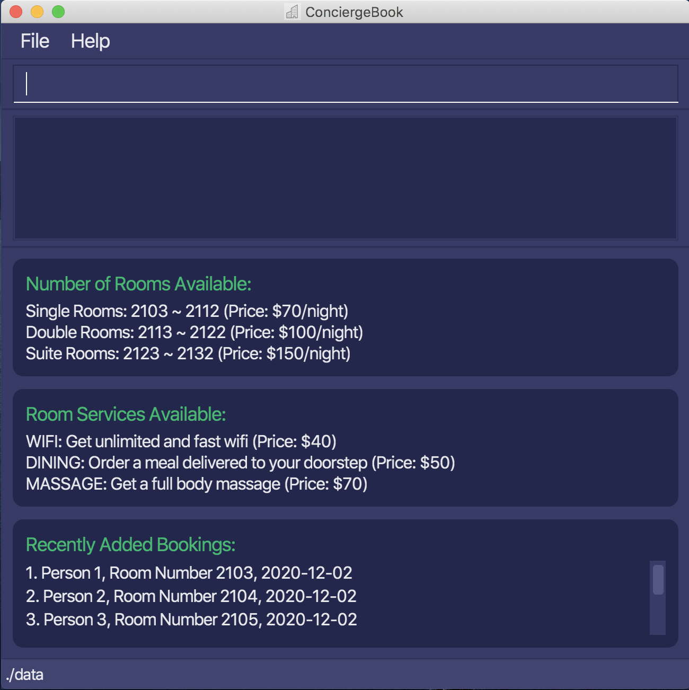

1. Now that you have got ConciergeBook up and running, you may go through the rest of this user guide to learn how
you can use the app!

--------------------------------------------------------------------------------------------------------------------

## Walk-through

This section aims to introduce to a new user the core set of entities and functionalities in ConciergeBook. It provides
the user with an overview of how the app is designed, and how it is meant to be used.

### Guests Management

One of the core entities in ConciergeBook is `Person`, which represents the guests of our hotel.
Each person registered is assigned a unique person ID. 
ConciergeBook provides `CRUD` (Create, Read, Update & Delete) functionalities to manage the records of guests in the hotel
system.

### Hotel Rooms

Another core entity in ConciergeBook is `Room`, which represents the hotel rooms available in the system.
Each hotel room has a unique room ID.  We have different types
of rooms in the system, and they have different prices. Each room is only tied to 1 guest for easier management. Guest(s) can stay in the room for a particular period, and this is managed by the `Booking` entity which will be introduced in the next section.

### Bookings Management

The entity `Booking` ties the guest we have registered in our system to a room, thus representing a hotel booking. Each `Booking`
has a unique ID and lasts for a specific duration which is capped at `30 nights` (the maximum duration a guest can stay in a hotel room).
ConciergeBook provides `CRUD` functionalities for the management of hotel bookings in the system.
 

In addition, ConciergeBook also provides the following extension functionalities:
* The receptionist can order `RoomService` for a particular booking if requested by the guest. There are various types of room services available with different prices.
* The receptionist can easily compute the bill for a particular booking, so the guests can know how much they have to pay for their stay. The bill includes the price for the stay, as well as the cost of any additional room services ordered.

### End of Walk-through
We hope you now have a better understanding of how ConciergeBook works and are excited to get started. You should now head to the
[Features](#features) section, which specifies the CLI commands you could use to access the various functionalities as introduced.

--------------------------------------------------------------------------------------------------------------------

## Features

The features are categorised into 4 core set of functionalities as introduced in the [Walk-through](#walk-through),
with an additional section for miscellaneous features.
* [Guests Management Features](#guest-management-features)
* [Hotel Rooms Features](#hotel-rooms-features)
* [Booking Management Features](#booking-management-features)
* [Extension Features](#extension-features)
* [Miscellaneous Features](#miscellaneous-features)

**:information_source: Some Notes about the Command Format:** 

* Words in `UPPER_CASE` are the parameters to be supplied by the user. 
  e.g. in `addPerson n/NAME`, `NAME` is a parameter which can be used as `addPerson n/John Doe`.

* Items in square brackets are optional. 
  e.g in `findBooking [sd/START_DATE]`, the parameter start date is optional.

* Items with `…`​ after them can be used multiple times including zero times. 
  e.g. `[t/TAG]…​` can be used as ` ` (i.e. 0 times), `t/VIP`, `t/VIP t/halal food` etc.

* Parameters can be in any order. 
  e.g. if the command specifies `n/NAME p/PHONE_NUMBER`, `p/PHONE_NUMBER n/NAME` is also acceptable.

* If parameters are inputted multiple times where only one is expected, the last instance will be accepted.  
  e.g. if the command specifies `editBooking bid/2 sd/2020-11-12 sd/2020-11-15`, the new start date will be taken as `2020-11-15`. 
  

### Guest Management Features 

This set of features allows you to manage the guests in the system. You will be able to Create, Read, Update and Delete the Person objects, and also search for any Person currently registered in the system. When using these features, the Person UI will be displayed
and it should look like that:
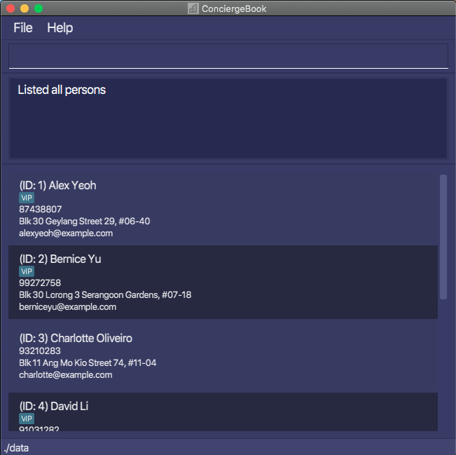

#### Listing all persons : `listPerson`

Lists all persons in ConciergeBook. 
This feature should be used when you want to switch to the Person UI, and view all the guests currently registered in the system.

Format: `listPerson`

#### Locating persons by name: `findPerson`

Finds persons whose names contain any of the given keywords. 
This feature is used when you want to check whether a particular person is already registered in the system before creating a booking for him/her with the person's ID. You can search via the person's name. If the person is not registered, you can look at the `addPerson` command to see how you can do so.

Format: `findPerson KEYWORD [MORE_KEYWORDS]`

* Only the name is searched.
* The search is case-insensitive. e.g `hans` will match `Hans`
* The order of the keywords does not matter. e.g. `Hans Bo` will match `Bo Hans`
* Only full words will be matched e.g. `Han` will not match `Hans`
* Persons matching at least one keyword will be returned (i.e. `OR` search).
  e.g. `Hans Bo` will return `Hans Gruber`, `Bo Yang`

Examples:
* `findPerson John` returns `john` and `John Doe`
* `findPerson tan ho` returns `Amy Tan`, `James Ho`, `Bob Tan` 
  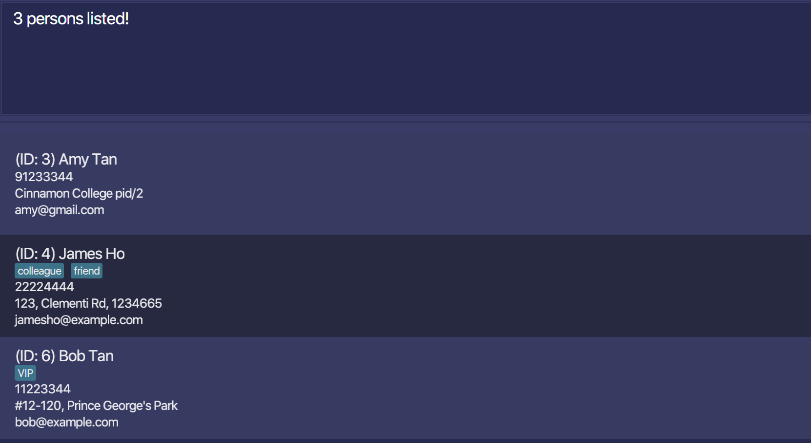

#### Adding a person: `addPerson`

Adds a person to the ConciergeBook. After doing so, you will be able to create a booking for the person with the newly assigned person ID. 

Format: `addPerson n/NAME p/PHONE_NUMBER e/EMAIL a/ADDRESS [t/TAG]...`
* Prefixes that are not listed in the format of the command may be parsed as part of another. 
* Address allows special characters e.g. `/`, `#`.

Examples:
* `addPerson n/Damith C Rajapakse p/90123456 e/dcsdcr@nus.edu.sg a/NUS SOC t/VVIP`
* `addPerson n/Amanda Leow p/82340582 e/amanda@yahoo.com.sg a/Orchard`
* `addPerson n/Amy Tan p/91233344 e/amy@gmail.com a/Cinnamon College pid/2` will create a person with `Cinnamon College pid/2`
as the address. 
* `addPerson n/Amy Tan pid/2 p/91233344 e/amy@gmail.com a/Cinnamon College` will throw an error as `/` is not allowed in name.

#### Editing a person : `editPerson`

Edits an existing person in ConciergeBook to update the guest's personal information.

Format: `editPerson pid/PERSON_ID [n/NAME] [p/PHONE] [e/EMAIL] [a/ADDRESS] [t/TAG]...`

* Edits the person with ID `PERSON_ID`.
* The PERSON_ID refers to the unique ID of the person.
* The PERSON_ID **must be a positive integer** 1, 2, 3, …​
* At least one of the optional fields must be provided.
* Existing values will be updated to the input values.
* When editing tags, the existing tags of the person will be removed i.e adding of tags is not cumulative.
* You can remove all the person’s tags by typing `t/` without specifying any tags after it.
* Prefixes that are not listed in the format of the command may be parsed as part of another. 

Examples:
*  `editPerson pid/1 p/91234567 e/johndoe@example.com` Edits the phone number and email address of the person with ID 1 to be `91234567` and `johndoe@example.com` respectively.
*  `editPerson pid/3 n/Betsy Crower` Edits the name of the 2nd person to be `Betsy Crower`.
  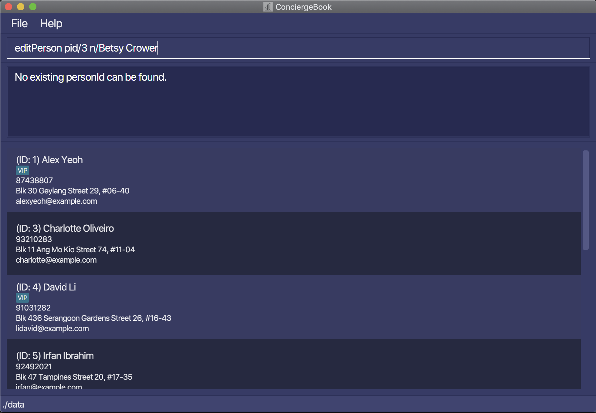

#### Deleting a person : `deletePerson`

Deletes the specified person from ConciergeBook.

Format: `deletePerson pid/PERSON_ID`

* Deletes the person with ID `PERSON_ID`.
* The PERSON_ID refers to the unique ID of the person.
* The PERSON_ID **must be a positive integer** 1, 2, 3, …​

Examples:
* `deletePerson pid/2` deletes the person with ID `2` in ConciergeBook.
  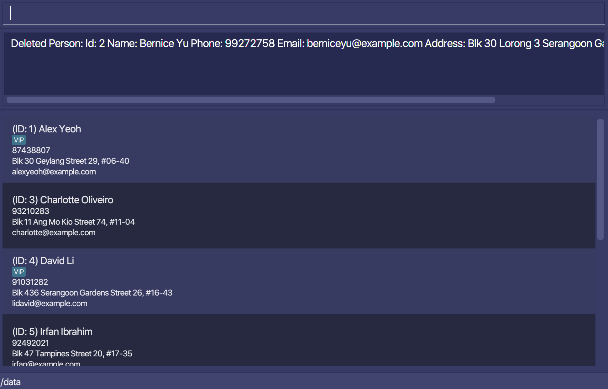

### Hotel Rooms Features

This set of features allows you to view the hotel rooms available in the system, so that you can find a suitable hotel room for the guest! The rooms will be listed as their unique room IDs, which can be used as the `ROOM_ID` in the `rid/ROOM_ID` parameter for managing the bookings.

#### Listing hotel rooms: `listRoom`

Shows a list of all the rooms in the room book with their unique room IDs.

Format: `listRoom [typ/ROOM_TYPE]`

* An optional `ROOM_TYPE` can be provided to filter the list based on the hotel room’s type. Only 1, 2, and 3 are accepted 
  as parameters. 1 indicates Single Rooms, 2 indicates Double Rooms, 3 indicates Suite Rooms. 

Examples:
* `listRoom` will list all the rooms in the Room Book with their unique room IDs. 
* `listRoom typ/3` will list all the suite rooms in the Room Book with their unique room IDs. 
  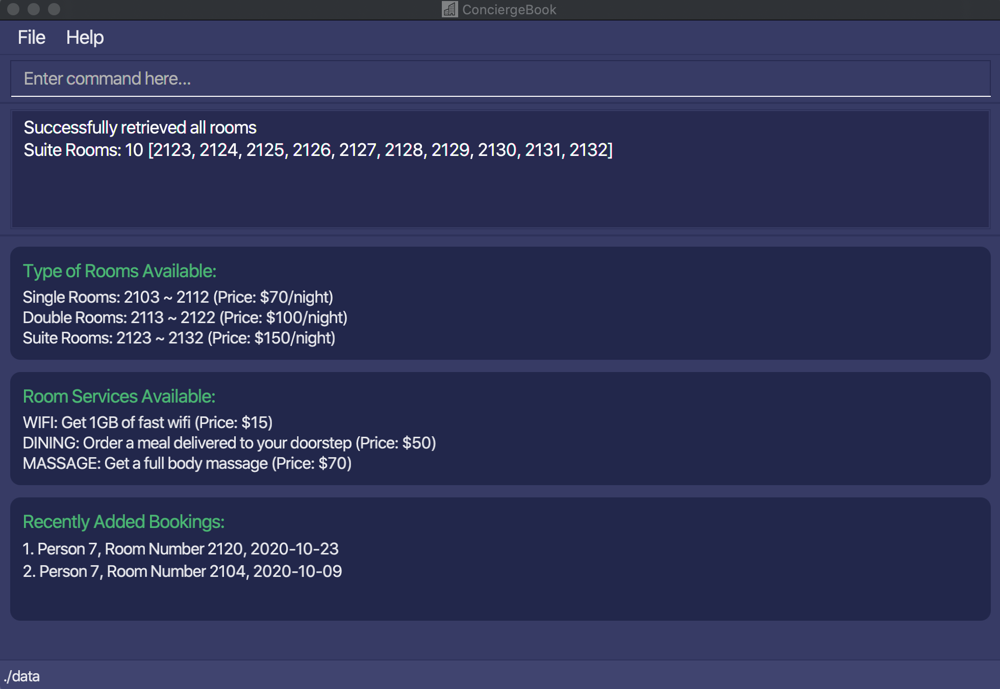

#### Filtering hotel rooms: `filterRoom`

Allows user to quickly search for the available rooms during a time period. 
This feature is used for you to find a suitable room for the guest who is planning to stay during a particular time period. The rooms available will be returned as an array of unique room IDs which can then be used to create the booking.

Format: `filterRoom sd/START_DATE ed/END_DATE [typ/ROOM_TYPE]`

* Both `START_DATE` and `END_DATE` have to be provided to list all the hotel rooms that are available within those dates.
* Dates have to be in the format `yyyy-MM-dd`
* An optional `ROOM_TYPE` can be provided to filter the list based on the hotel room’s type. Only 1, 2, and 3 are accepted 
as parameters. 1 indicates Single Rooms, 2 indicates Double Rooms, 3 indicates Suite Rooms. 

Examples:
* `filterRoom sd/2020-09-14 ed/2020-09-17` filters all the hotel rooms which are available from Sept 14 2020 to Sept 17 2020.
* `filterRoom sd/2020-11-09 ed/2020-11-15 typ/2` filters all double rooms which are available from Nov 9 2020 to Nov 15 2020.
  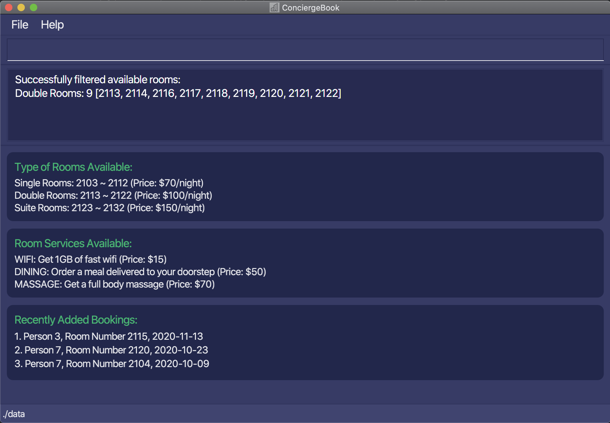

### Booking Management Features

This set of features allows you to manage the bookings in the system. You will be able to Create, Read, Update and Delete the Booking objects, and also search for any Booking currently created in the system. When using these features, the Booking UI will be displayed
and it should look like that:
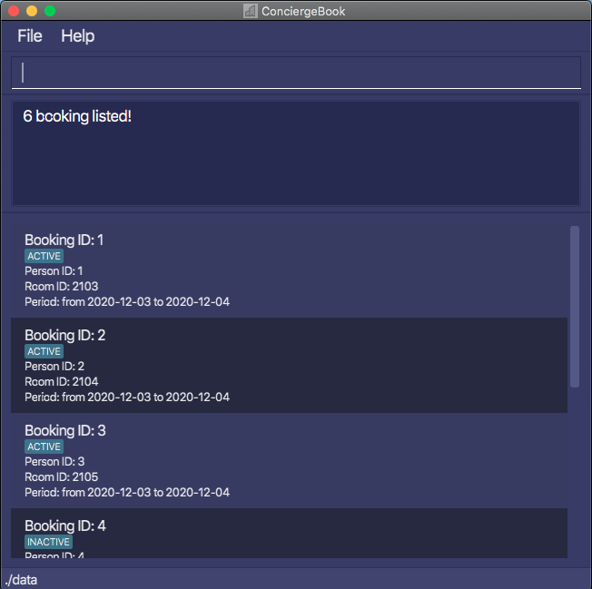

#### Listing bookings: `listBooking`
Lists the bookings sorted by start date. Bookings with latest start date will be shown first. Archived bookings will be shown at the end. 
This feature should be used when you want to switch to the Booking UI, and view all the bookings currently in the system.

Format: `listBooking`

* Lists all the bookings.

Examples:
* `listBooking` lists all the bookings.

#### Adding Booking: `addBooking`

A Booking is tied to a person specified by the PERSON_ID and a room specified by the ROOM_ID, for a particular time period.
To add a booking, this is the recommended workflow:
1. If the person to be added has not been registered, use `addPerson` command to register the person in the system.
2. Use `findPerson` command to search for the person using his/her name and take note of his/her PERSON_ID.
3. Use `filterRoom` to find all available rooms during that particular time period and take note of the ROOM_ID.
4. Use the `addBooking` command to add the booking into the system with PERSON_ID and ROOM_ID.

Format: `addBooking pid/PERSON_ID rid/ROOM_ID sd/START_DATE ed/END_DATE`

* Add a booking for a person with `PERSON_ID` at the specified `ROOM_ID` from `START_DATE` to `END_DATE`.     
* The specified `PERSON_ID` of the person **must be a positive integer** and **must have been added to ConciergeBook**.
* The `ROOM_ID` **must be a positive integer** and **have to correspond to an existing room in the hotel.** 
* The `ROOM_ID` determines what type of hotel room it is. Single rooms ($70/night) are from `ROOM_ID` 2103 to 2112.
Double rooms ($100/night) are from `ROOM_ID` 2113 to 2122. Suite rooms ($150/night) are from `ROOM_ID` 2123 to 2132.
* Both the `START_DATE` and `END_DATE` **must be in valid date format in the format yyyy-MM-dd.**
* `START_DATE` must be before `END_DATE`, and the maximum duration of stay must be less than or equal to 30 nights.
* All the fields must be provided.
* The added booking cannot be a duplicate booking or conflict with any existing bookings.  
* Note: only a single person should be tied to a booking, as we only require a single point-of-contact to be registered in the system. More than 1 person can definitely stay in the hotel room.
* Note: ConciergeBook believes the user knows best. ConciergeBook will give users the autonomy to add bookings as he/she
sees fit. Hence, users are allowed to add bookings far into the future or in the past if it is necessary for the user to do so.  
 
Example:
*  `addBooking pid/5 rid/2120 sd/2020-12-12 ed/2020-12-25` Add booking for person with person ID `5` into room ID `2120`
from 12 December 2020 to 25 December 2020.
  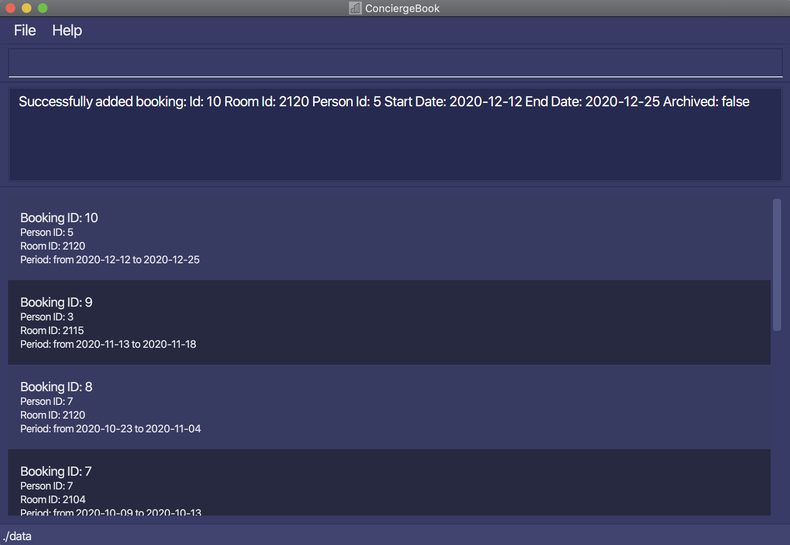

#### Editing a booking : `editBooking`

Edits an existing booking in the booking book. You should search for the booking you want to edit first using `findBooking` and 
note its BOOKING_ID.

Format: `editBooking bid/BOOKING_ID [rid/ROOM_ID] [sd/START_DATE] [ed/END_DATE]`

* Edits the booking with booking ID `BOOKING_ID`. The id **must be a positive integer** 1, 2, 3, …​
* Date must have the format of `yyyy-MM-dd`.
* At least one of the optional fields must be provided.
* Existing values will be updated to the input values.
* The edited booking cannot be a duplicate booking or conflicts with any existing booking.

Examples:
*  `editBooking bid/2 rid/2105` Edits the room ID of the booking with ID `2` to be `2105`.
*  `editBooking bid/1 sd/2021-11-23` Edits the start date of the booking with ID `2` to be `2021-12-13`.
  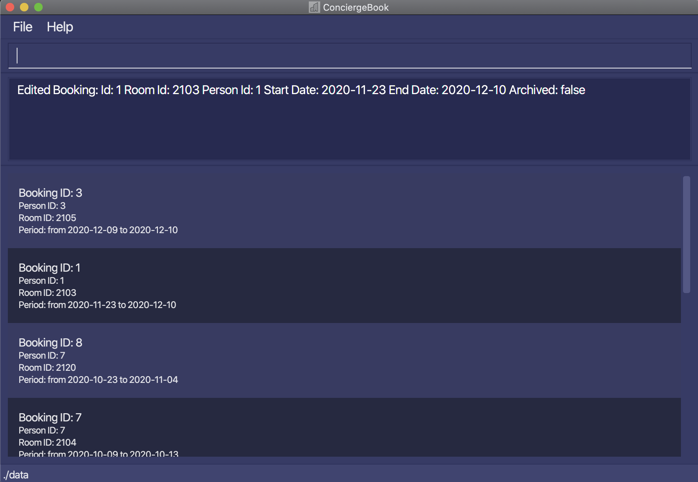

#### Deleting a booking : `deleteBooking`

Deletes a booking in the booking book. You should search for the booking you want to delete first using `findBooking` and 
note its BOOKING_ID.

Format: `deleteBooking bid/BOOKING_ID`

* Deletes the booking with booking ID `BOOKING_ID`. The ID **must be a positive integer** 1, 2, 3, …​ 
 and must be present in the bookingBook.

Examples:
*  `deleteBooking bid/1` Deletes the booking with ID 1.

#### Locating bookings: `findBooking`

Finds the bookings which match all the given predicates. This feature is used when you want to find a booking related to a
particular person, room, for a particular period and whether it is archived. 

Format: `findBooking [pid/PERSON_ID] [rid/ROOM_ID] [sd/START_DATE] [ed/END_DATE] [ac/IS_ARCHIVED]`

* The order of the parameters does not matter. e.g. `findBooking pid/3 rid/2103` is the same as `findBooking rid/2103 pid/3 `
* the input room ID and person ID must be valid (registered in the database).
* At least one parameter should be provided.

Examples:
* `findBooking pid/3` returns all the bookings related to the person with person ID 3.
* `findBooking sd/2020-11-12 ed/2020-11-16` returns all the bookings which starts from 12 Nov 2020 and ends on 16 Nov 2020.
  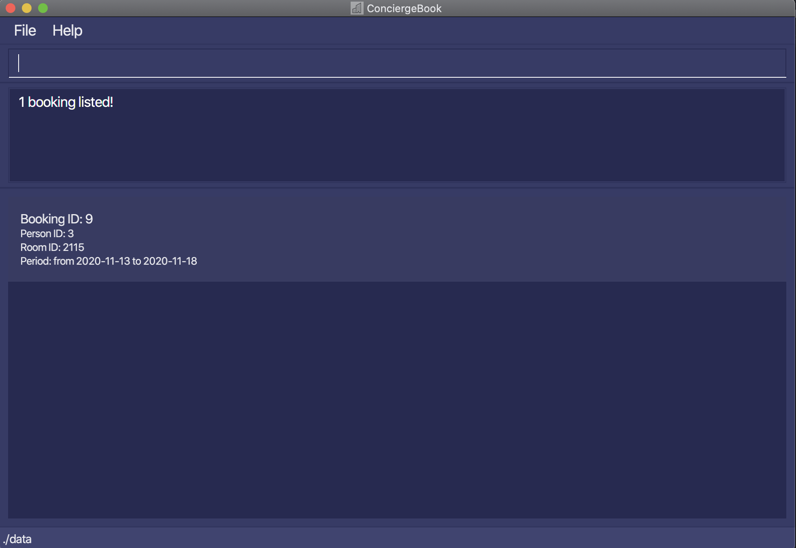

#### Archiving a booking: `archiveBooking`

Archives a booking - similar to deleting, but we still store it on the disk. The room for the booking can
now be occupied by a guest in the same period. Bookings in the past are not necessarily archived as the data might still be used for hotel management purposes such as customer preference data analysis.

Format: `archiveBooking bid/BOOKING_ID`

* Archives booking with the specified `BOOKING_ID`.  
* The `BOOKING_ID` refers to the unique identifier of the booking. 
* The `BOOKING_ID` must be a valid booking ID of an unarchived booking in the BookingBook.  

Example:
* `archiveBooking bid/10` archives booking with the valid booking ID of `1`.
  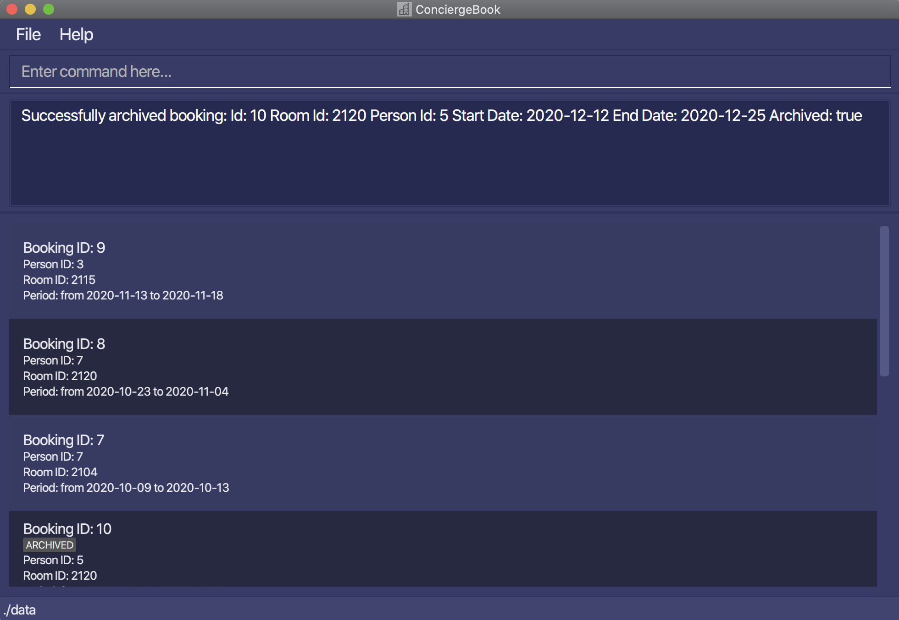

#### Unarchiving a booking: `unarchiveBooking`

Unarchives an already archived booking (undos the previous command).  
For consistency, a booking cannot be unarchived if there is an existing active duplicate booking or an existing
active conflicting booking.

Format: `unarchiveBooking bid/BOOKING_ID`

* Unarchives booking with the specified `BOOKING_ID`.  
* The `BOOKING_ID` refers to the unique identifier of the booking. 
* The `BOOKING_ID` must be a valid booking ID of an archived booking in the BookingBook.  

Example:
* `unarchiveBooking bid/10` unarchives booking with the valid booking ID of `10`.
  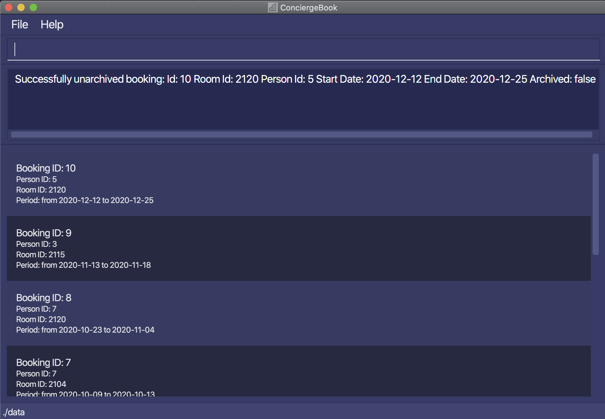

### Extension Features

This set of features extend the Booking Management features, and provides additional functionalities related to Bookings.
The Booking UI will be shown for this set of features.

#### Ordering Room Service : `orderRoomService`

Order room service for a particular booking to provide the guest with a more enjoyable stay. 
To find out the BOOKING_ID of the booking you want to order the room service for, you can use the `findBooking` command. 
Also, check out the home page via the `home` command to see the available list of room services and their prices.

Format: `orderRoomService bid/BOOKING_ID rst/ROOM_SERVICE_TYPE`

* Adds room service to booking with booking ID `BOOKING_ID`. The id **must be a valid integer** 1, 2, 3, …​
* The `BOOKING_ID` must be a valid booking ID in the BookingBook.
* The room service type must be one of the following values: `WIFI`, `DINING`, `MASSAGE`. These values are case-insensitive.
* Only one room service can be added at one time. If you input multiple room services, only the last one is added.

Examples:
*  `orderRoomService bid/2 rst/DINING` Orders DINING room service for booking with ID `2`.
*  `orderRoomService bid/10 rst/WIFI` Orders WIFI room service for booking with ID `10`.

  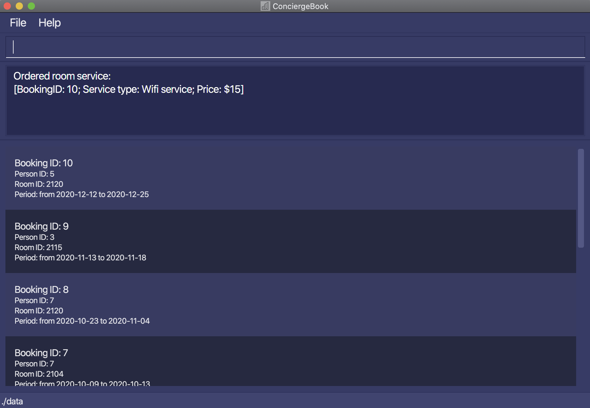

#### Viewing a bill: `getBill`

Gets the bill of a specified booking ID.  
The bill displayed will show the details of the:
* Number of nights stayed  
* Price per night  
* Room services ordered, if there is any. Else, it will show "No room services ordered"  
* Nett bill for the BOOKING_ID queried

To find out the BOOKING_ID of the booking you want to get the bill for, you can use the `findBooking` command.

Format: `getBill bid/BOOKING_ID`

* The `BOOKING_ID` refers to the unique identifier of the booking.  
* The `BOOKING_ID` must be a valid booking ID in the BookingBook.    

Example:
* `getBill bid/9` shows the bill for the booking ID `9`.  
  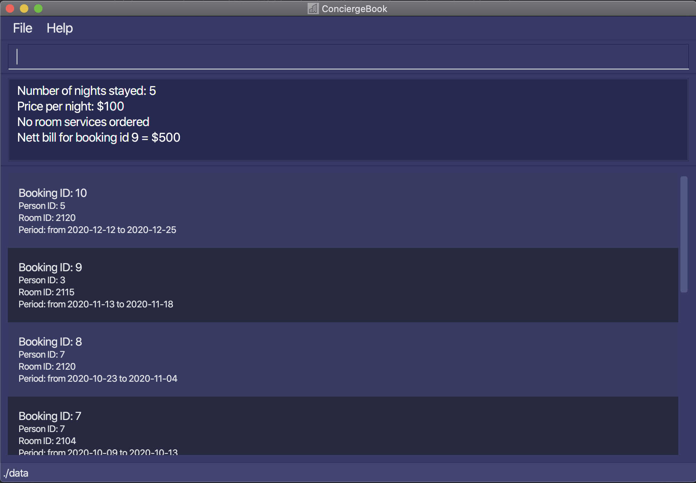

### Miscellaneous Features

#### Showing home page: `home`

Shows the home page of ConciergeBook

Format: `home`

#### Viewing help : `help`

Shows a message explaining how to access the help page.

Format: `help`

#### Clearing all entries : `clear`

Clears all entries from ConciergeBook. Use with caution.  

Format: `clear`

#### Exiting the program : `exit`

Exits the program.

Format: `exit`

#### Saving the data

ConciergeBook data is saved in the hard disk automatically after any command that changes the data. There is no need to save manually. The data will be saved in a `data/` folder inside the home folder for ConciergeBook.

--------------------------------------------------------------------------------------------------------------------

## Command summary

Action | Format, Examples
--------|------------------
**List Person** | `listPerson`
**Find Person** | `findPerson KEYWORD [MORE_KEYWORDS]`  e.g., `findPerson James Jake`
**Add Person** | `addPerson n/NAME p/PHONE_NUMBER e/EMAIL a/ADDRESS [t/TAG]…​`   e.g., `addPerson n/James Ho p/22224444 e/jamesho@example.com a/123, Clementi Rd, 1234665 t/vip t/vegetarian`
**Edit Person** | `editPerson pid/PERSON_ID [n/NAME] [p/PHONE_NUMBER] [e/EMAIL] [a/ADDRESS] [t/TAG]…​`  e.g.,`editPerson pid/2 n/James Lee e/jameslee@example.com`
**Delete Person** | `deletePerson pid/PERSON_ID`  e.g., `deletePerson pid/3`
**List Room** | `listRoom`
**Filter Room** | `filterRoom sd/START_DATE ed/END_DATE [typ/ROOM_TYPE]`  e.g., `filterRoom sd/2020-09-14 ed/2020-09-17 typ/3`
**List Booking** | `listBooking`  e.g., `listBooking`
**Find Booking** | `findBooking [rid/ROOM_ID] [pid/PERSON_ID] [sd/START_DATE] [ed/END_DATE] [ac/IS_ARCHIVED]`   e.g. `findBooking pid/1 rid/2104`
**Add Booking** | `addBooking pid/PERSON_ID rid/ROOM_ID sd/START_DATE ed/END_DATE`  e.g., `addBooking pid/5 rid/2105 sd/2020-12-12 ed/2020-12-25`
**Edit Booking** | `editBooking bid/BOOKING_ID [rid/ROOM_ID] [sd/START_DATE] [ed/END_DATE]`   e.g. `editBooking bid/1 rid/2104`
**Delete Booking** | `deleteBooking bid/BOOKING_ID`  e.g., `deleteBooking bid/3`
**Archive Booking** | `archiveBooking bid/BOOKING_ID`  e.g., `archiveBooking bid/3`
**Unarchive Booking** | `unarchiveBooking bid/BOOKING_ID`  e.g., `unarchiveBooking bid/3`
**Order Room Service** | `orderRoomService bid/BOOKING_ID rst/ROOM_SERVICE_TYPE`  e.g., `orderRoomService bid/1 rst/WIFI`
**Get Bill** | `getBill bid/BOOKING_ID`  e.g., `getBill bid/6`

**Home** | `home` 
**Help** | `help` 
**Clear** | `clear` 
**Exit** | `exit`

--------------------------------------------------------------------------------------------------------------------

## FAQ

**Q**: How do I transfer my data to another Computer? 
**A**: Install the app on the other computer and overwrite the empty data file it creates with the file that contains the data of your previous ConciergeBook home folder.
