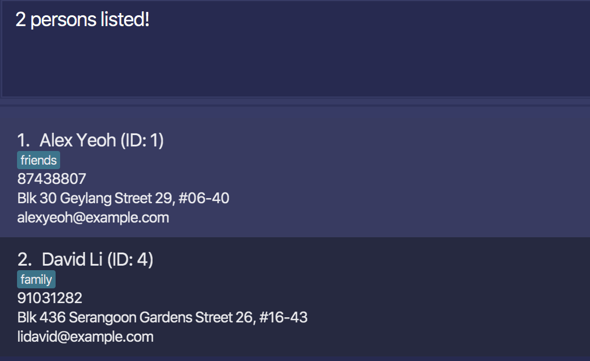

``---
layout: page
title: User Guide
---

ConciergeBook (CB) is a **desktop app for hotel receptionists to efficiently manage guest bookings via a Command Line Interface** (CLI) while still having the benefits of a Graphical User Interface (GUI). If you can type fast, ConciergeBook can help you optimise how you manage your rooms, your guests and all new and existing bookings - faster than traditional GUI apps.

* Table of Contents
{:toc}

--------------------------------------------------------------------------------------------------------------------

## Quick start

1. Ensure you have Java `11` or above installed in your Computer.

1. Download the latest `conciergebook.jar` from [here](https://github.com/AY2021S1-CS2103-W14-2/tp/releases).

1. Copy the file to the folder you want to use as the _home folder_ for your ConciergeBook.

1. Double-click the file to start the app. The GUI similar to the below should appear in a few seconds. Note how the app contains some sample data. 
   

1. Type the command in the command box and press Enter to execute it. e.g. typing **`help`** and pressing Enter will open the help window. 
   Some example commands you can try:

   * **`list`** : Lists all contacts.

   * **`add`**`n/John Doe p/98765432 e/johnd@example.com a/John street, block 123, #01-01` : Adds a contact named `John Doe` to the Address Book.

   * **`delete`**`3` : Deletes the 3rd contact shown in the current list.

   * **`clear`** : Deletes all contacts.

   * **`exit`** : Exits the app.

1. Refer to the [Features](#features) below for details of each command.

--------------------------------------------------------------------------------------------------------------------

## Features

**:information_source: Notes about the command format:** 

* Words in `UPPER_CASE` are the parameters to be supplied by the user. 
  e.g. in `add n/NAME`, `NAME` is a parameter which can be used as `add n/John Doe`.

* Items in square brackets are optional. 
  e.g `n/NAME [t/TAG]` can be used as `n/John Doe t/friend` or as `n/John Doe`.

* Items with `…`​ after them can be used multiple times including zero times. 
  e.g. `[t/TAG]…​` can be used as ` ` (i.e. 0 times), `t/friend`, `t/friend t/family` etc.

* Parameters can be in any order. 
  e.g. if the command specifies `n/NAME p/PHONE_NUMBER`, `p/PHONE_NUMBER n/NAME` is also acceptable.

### Viewing help : `help`

Shows a message explaning how to access the help page.

Format: `help`

### Adding a person: `addPerson`

Adds a person to the local guestbook. 

Format: `addPerson n/NAME p/PHONE_NUMBER e/EMAIL`

Examples:
* `add n/Damith C. Rajapakse p/90123456 e/dcsdcr@nus.edu.sg`
* `add n/Amanda Leow p/82340582 e/amanda@yahoo.com.sg`

### Listing all persons : `listPerson`

Lists persons that contain the required phone number.

Format: `list PHONE_NUMBER`
* Only phone number of Persons will be searched
* Only full phone numbers will be matched e.g. `91234567` will not match `91234568`
* Only returns 1 guest as phone number of persons are unique
* `PHONE_NUMBER` needs to be have 8 digits 

Examples: 
* `list 90123456`  will return `Damith`

### Editing a person : `editPerson`

Edits an existing person in the guestbook.

Format: `editPerson INDEX [n/NAME] [p/PHONE] [e/EMAIL]`

* Edits the person at the specified `INDEX`. The index refers to the index number shown in the displayed person list. The index **must be a positive integer** 1, 2, 3, …​
* At least one of the optional fields must be provided.
* Existing values will be updated to the input values.
* When editing tags, the existing tags of the person will be removed i.e adding of tags is not cumulative.
* You can remove all the person’s tags by typing `t/` without
    specifying any tags after it.

Examples:
*  `editPerson 1 p/91234567 e/johndoe@example.com` Edits the phone number and email address of the 1st person to be `91234567` and `johndoe@example.com` respectively.
*  `editPerson 2 n/Betsy Crower` Edits the name of the 2nd person to be `Betsy Crower`.

### Locating persons by name: `findPerson`

Finds persons whose names contain any of the given keywords.

Format: `findPerson KEYWORD [MORE_KEYWORDS]`

* The search is case-insensitive. e.g `hans` will match `Hans`
* The order of the keywords does not matter. e.g. `Hans Bo` will match `Bo Hans`
* Only the name is searched.
* Only full words will be matched e.g. `Han` will not match `Hans`
* Persons matching at least one keyword will be returned (i.e. `OR` search).
  e.g. `Hans Bo` will return `Hans Gruber`, `Bo Yang`

Examples:
* `findPerson John` returns `john` and `John Doe`
* `findPerson alex david` returns `Alex Yeoh`, `David Li` 
  

### Deleting a person : `deletePerson`

Deletes the specified person from the guestbook.

Format: `deletePerson INDEX`

* Deletes the person at the specified `INDEX`.
* The index refers to the index number shown in the displayed person list.
* The index **must be a positive integer** 1, 2, 3, …​

Examples:
* `listPerson` followed by `deletePerson 2` deletes the 2nd person in the guestbook.
* `findPerson Betsy` followed by `deletePerson 1` deletes the 1st person in the results of the `findPerson` command.

### Viewing a bill: `getBill`

Finds the bill with a room ID and a date (the last day of a booking).

Format: `getBill id/ROOM_ID ed/BOOKING_END_DATE`

* The room ID must be a valid room number
* Dates have to be in the format YYYY-MM-DD

Examples:
* `getBill id/2103 ed/2020-09-15` shows the bill for the booking on Room 2103 which ends on 15 Sep 2020. 

### Checking in guest: `checkIn`
Checks in a guest into the hotel.

Format: checkIn checkIn n/NAME p/PHONE_NUMBER id/ROOM_ID sd/START_DATE ed/END_DATE

* Checks in the guest into the specified ROOM_ID
* The roomId refers to the unique identifier of the room
* The guest name and phone number and room ID must be unique.
* The room ID must be a valid room number.
* GUEST_IC needs to be a 5 lettered-string, with the first as a character and the remaining 4 as numbers
Dates have to be in the format YYYY-MM-DD.

Examples:
* checkIn n/James Ho p/22224444 id/4102 sd/2020-09-14 ed/2020-09-17 checks in a guest whose name is James Ho and phone number is 22224444 into room 4102 from 
14 September 2020 to 17 September 2020.

### Checking out guest: `checkOut`
Checks out a guest from the hotel.

Format: checkOut ROOM_ID

* Checks out the guest staying at ROOM_ID.
* The room ID refers to the unique identifier of the room. 
* The room ID must be a valid room number (4-digit number e.g. 2103, 1010, 3103)

Examples:
* checkOut 2103 checks out the guest who stays in room 2103.

### Listing hotel rooms: `listRoom`
Lists the hotel rooms with some optional filters.

Format: `listRoom [sd/START_DATE] [ed/END_DATE] [rt/ROOM_TYPE]`

* Lists all the hotel rooms if none of the arguments are provided.
* Both START_DATE and END_DATE have to be provided to list all the hotel rooms that are available from the START_DATE to END_DATE.
* Dates have to be in the format YYYY-MM-DD
* An optional ROOM_TYPE can be provided to filter the list based on the hotel room’s type.

Examples:
* listRoom sd/2020-09-14 ed/2020-09-17 lists all the hotel rooms which are available from Sept 14 2020 to Sept 17 2020.
* listRoom rt/single lists all the hotel rooms of single type.

### Listing bookings: `listBooking`
Lists the bookings with some optional filters.

Format: `listBooking [sd/START_DATE] [ed/END_DATE]`

* Lists all the bookings if none of the arguments are provided.
* Dates have to be in the format YYYY-MM-DD

Examples:
* listBooking sd/2020-09-14 ed/2020-09-17 lists all the bookings which are from Sept 14 2020 to Sept 17 2020.

### Clearing all entries : `clear`

Clears all entries from the address book.

Format: `clear`

### Exiting the program : `exit`

Exits the program.

Format: `exit`

### Saving the data

ConciergeBook data are saved in the hard disk automatically after any command that changes the data. There is no need to save manually.

--------------------------------------------------------------------------------------------------------------------

## FAQ

**Q**: How do I transfer my data to another Computer? 
**A**: Install the app in the other computer and overwrite the empty data file it creates with the file that contains the data of your previous ConciergeBook home folder.

--------------------------------------------------------------------------------------------------------------------

## Command summary

Action | Format, Examples
--------|------------------
**Add Person** | `addPerson n/NAME p/PHONE_NUMBER e/EMAIL a/ADDRESS [t/TAG]…​`   e.g., `addPerson n/James Ho p/22224444 e/jamesho@example.com a/123, Clementi Rd, 1234665 t/friend t/colleague`
**Clear Person** | `clearPerson`
**Delete Person** | `deletePerson INDEX`  e.g., `deletePerson 3`
**Edit Person** | `editPerson INDEX [n/NAME] [p/PHONE_NUMBER] [e/EMAIL] [a/ADDRESS] [t/TAG]…​`  e.g.,`editPerson 2 n/James Lee e/jameslee@example.com`
**Find Person** | `findPerson KEYWORD [MORE_KEYWORDS]`  e.g., `findPerson James Jake`
**List Person** | `listPerson`
**Check In** | `checkIn n/NAME p/PHONE_NUMBER id/ROOM_ID sd/START_DATE ed/END_DATE`  e.g., `checkIn n/James Ho p/22224444 id/4102 sd/2020-09-14 ed/2020-09-17`
**Check Out** | `checkOut ROOM_ID`
**list Room** | `listRoom sd/START_DATE ed/END_DATE rt/ROOM_TYPE`  e.g., `listRoom sd/2020-09-14 ed/2020-09-17`
**list Booking** | `listBooking sd/START_DATE ed/END_DATE`  e.g., `listBooking sd/2020-09-14 ed/2020-09-17`
**Get Bill** | `getBill id/ROOM_ID ed/BOOKING_END_DATE`  e.g., `getBill id/2103 ed/2020-09-15`

**Help** | `help`
