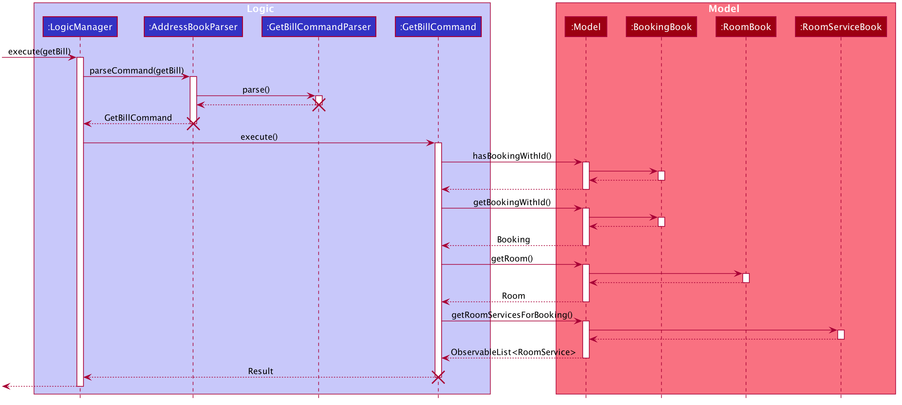
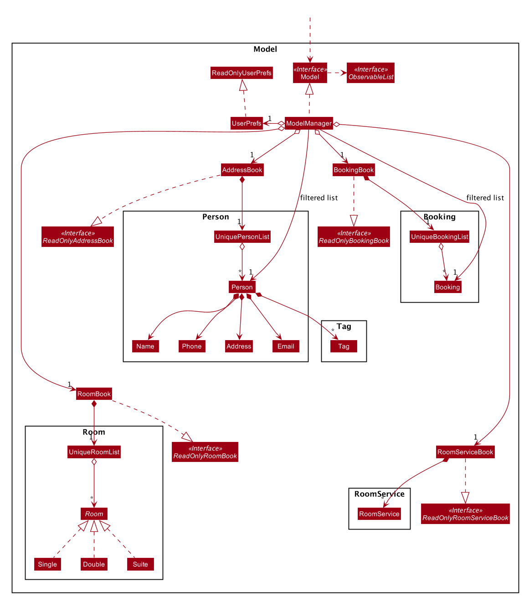
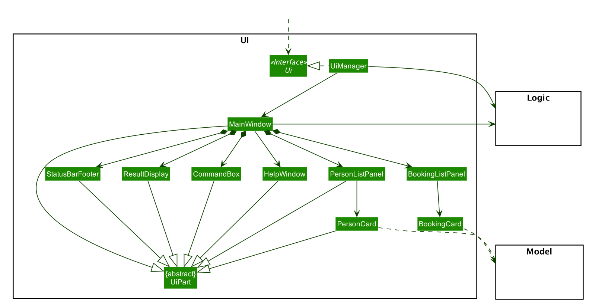

## Project: ConciergeBook 

ConciergeBook (CB) is a **desktop app for hotel receptionists to efficiently manage guest bookings via a Command Line Interface** (CLI) 
while still having the benefits of a Graphical User Interface (GUI). If you can type fast, 
ConciergeBook can help you optimise how you manage your rooms, your guests and all new and existing bookings - 
faster than traditional GUI apps.

Given below are my contributions to the project.

* **New Feature**: Room Management
    1. Listing Room 
        * What it does: allows the user to list all rooms. Users can list rooms by types as well. 
        * Justification: This feature allows the user to swiftly know all rooms available in the system. 
    1. Filtering Room
        * What it does: allows the user to know which rooms are available within a certain start and end date.
        * Justification: This feature allows the user to swiftly select a room id to attach to a new booking. 
        * Highlights: This feature allows the user to filter by room types as well to match the guests' requirements.
        
* **Code Contributed**: [RepoSense Link](https://nus-cs2103-ay2021s1.github.io/tp-dashboard/#breakdown=true&search=hazel1603&sort=groupTitle&sortWithin=title&since=2020-08-14&timeframe=commit&mergegroup=&groupSelect=groupByRepos&checkedFileTypes=docs~functional-code~test-code~other&until=2020-11-09&tabOpen=true&tabType=authorship&tabAuthor=Hazel1603&tabRepo=AY2021S1-CS2103-W14-2%2Ftp%5Bmaster%5D&authorshipIsMergeGroup=false&authorshipFileTypes=docs~functional-code~test-code)

* **Documentation**:
    * User Guide:
        * Did cosmetic tweaks to existing documentation of features `addPerson`, `findPerson`, `deletePerson`, `editPerson` and `listPerson` 
            [\#18](https://github.com/AY2021S1-CS2103-W14-2/tp/pull/18) [\#196]()
        * Added documentation for new command: `getBill` [\#18](https://github.com/AY2021S1-CS2103-W14-2/tp/pull/18) 
        * Modified `filterRoom` and `listRoom` documentation [\#115](https://github.com/AY2021S1-CS2103-W14-2/tp/pull/115)
    * Developer Guide:
        * Updated UML Diagrams of Architecture [\#129](https://github.com/AY2021S1-CS2103-W14-2/tp/pull/129/files)
        * Added Filter Room Feature [\#105](https://github.com/AY2021S1-CS2103-W14-2/tp/pull/105)
        * Added Get Bill Feature [\#230](https://github.com/AY2021S1-CS2103-W14-2/tp/pull/230)
        * Updated User Stories [\#129](https://github.com/AY2021S1-CS2103-W14-2/tp/pull/129/files), [\#230](https://github.com/AY2021S1-CS2103-W14-2/tp/pull/230)
        * Updated Use Cases [\#129](https://github.com/AY2021S1-CS2103-W14-2/tp/pull/129/files), [\#230](https://github.com/AY2021S1-CS2103-W14-2/tp/pull/230)
       
* **Enhancements to Existing Features**:
    * Wrote additional test cases to increase test coverage of Room Book to 100% and UniqueRoomList to 93% 
        (Pull Request [\#112](https://github.com/AY2021S1-CS2103-W14-2/tp/pull/112), [\#120](https://github.com/AY2021S1-CS2103-W14-2/tp/pull/120))
    
* **Contributions to team-based tasks**:
    * Modified and refactored the names of AB3 Commands (Pull Request [\#117](https://github.com/AY2021S1-CS2103-W14-2/tp/pull/117))
    * Standardised Error Messages across the application 
    (Pull Request [\#117](https://github.com/AY2021S1-CS2103-W14-2/tp/pull/117), [\#121](https://github.com/AY2021S1-CS2103-W14-2/tp/pull/121))
    * Created Rooms of different room types to be used as the premise for our application. 
    (Pull Requests [\#42](https://github.com/AY2021S1-CS2103-W14-2/tp/pull/42) [\#88](https://github.com/AY2021S1-CS2103-W14-2/tp/pull/88))
        
* **Contributions to teammates**:
    * Created a new feature under Bookings: Restriction of Stay Duration (Pull Request [\#195]())
        * What it does: Prevents the user from creating or editing a booking to be longer than 30 days. 
        * Justification: This feature allows the app to model after reality better, where there are usually restrictions on the length of stay. 
        * Affected: addBooking and editBooking commands 
    * Made small tweaks to Home Page display under UI (Pull Request [\#194](https://github.com/AY2021S1-CS2103-W14-2/tp/pull/194))
    
### Contributions to Developer Guide (Extracts)
* Diagrams drawn for Get Bill Feature 
    * The following diagram is the Activity Diagram for Get Bill.  
    
    * The following diagram is the Sequence Diagram for Get Bill.   
    
Similar Diagrams were drawn for the Filter Room Feature. 
    
* Diagrams drawn for Architecture Component 
    * The following diagram was used for the Storage component in Architecture. 
    
    * The following diagram was used for the Model component in Architecture. 
    
    * The following diagram was used for the UI component in Architecture. 
    
